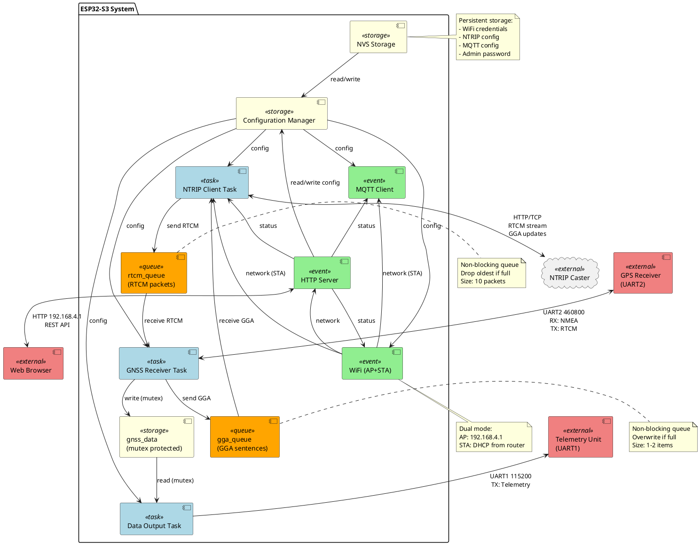

# ESP32-S3 Multi-Task System Architecture

## System Overview

This design describes a comprehensive ESP32-S3 based system that combines real-time embedded control with web-based configuration management. The system operates in dual WiFi mode (AP+STA), providing both internet connectivity and a persistent configuration interface. At its core, the architecture features a thread-safe configuration manager backed by NVS (Non-Volatile Storage) that coordinates settings across multiple subsystems including WiFi connectivity, NTRIP client for GPS corrections, MQTT client for data publishing, GPS receiver communication, telemetry data output, and a web server for user configuration. The system leverages FreeRTOS for task management, running dedicated tasks for NTRIP streaming, GPS receiver communication, and telemetry data output, while WiFi and MQTT utilize event-driven architectures with built-in task management. User configuration is accessible via a web interface served on the persistent Access Point (192.168.4.1), while internet services operate through the Station mode connection to the user's router. All components communicate through FreeRTOS primitives (queues, mutexes, event groups) ensuring thread-safe operation and efficient resource utilization across both CPU cores of the ESP32-S3.

---

## PlantUML Component Diagram



### Diagram Legend:

- **Blue Components (<<task>>)**: FreeRTOS tasks with dedicated execution contexts
- **Green Components (<<event>>)**: Event-driven components with internal tasks
- **Yellow Components (<<storage>>)**: Storage and configuration management
- **Coral Components (<<external>>)**: External hardware/services
- **Orange Queues**: FreeRTOS queues for inter-task communication
- **Solid arrows**: Data/control flow
- **Dashed lines**: Configuration/status queries

### Key Dataflows:

1. **RTCM Corrections Flow**: NTRIP Caster → NTRIP Task → rtcm_queue → GNSS Task → GPS Receiver (UART2)
2. **GGA Position Flow**: GPS Receiver → GNSS Task → gga_queue → NTRIP Task → NTRIP Caster
3. **Position Output Flow**: GPS Receiver → GNSS Task → gnss_data (mutex) → Data Output Task → Telemetry Unit (UART1)
4. **Configuration Flow**: Web Browser → HTTP Server → Config Manager → NVS

---

For a multi-task ESP32 system with web-based configuration, here's the best architectural approach:

Recommended Architecture:

# 1. Configuration Storage Layer

┌─────────────────────────────────────┐
│   NVS (Non-Volatile Storage)        │ ← Persistent storage
└─────────────────────────────────────┘
           ↕ (Read/Write)
┌─────────────────────────────────────┐
│  Configuration Manager Module       │ ← Centralized config
│  - Thread-safe access (mutex)       │
│  - Get/Set functions                │
│  - Validation                       │
│  - Notify subscribers on changes    │
└─────────────────────────────────────┘
   ↕         ↕         ↕         ↕           ↕
[WiFi]  [NTRIP]   [MQTT]  [Web Server]  [GNSS/Data Output]
          ↕                               ↕
    [rtcm_queue]                   [gnss_data (mutex)]
    [gga_queue]                    [Data Output Task]

# 2. Implementation Strategy

Configuration Manager (config.h/cpp):

 - Single source of truth for all settings
 - Struct-based configuration:
	```c
	typedef struct {
		char ssid[32];
		char password[64];
	} wifi_config_t;
	
	typedef struct {
		char host[128];
		uint16_t port;
		char mountpoint[64];
		char user[32];
		char password[64];
		uint16_t gga_interval_sec;     // Default: 120
		uint16_t reconnect_delay_sec;  // Default: 5
		bool enabled;                  // Default: true
	} ntrip_config_t;
	
	typedef struct {
		char broker[128];
		uint16_t port;
		char topic[64];
		char user[32];
		char password[64];
		bool enabled;  // Default: true
	} mqtt_config_t;
	
	typedef struct {
		wifi_config_t wifi;
		ntrip_config_t ntrip;
		mqtt_config_t mqtt;
	} app_config_t;
	```

JSON Configuration Format:
	```json
	{
		"wifi": {
			"ssid": "ssid",
			"password": "wifi_password"
		},
		"ntrip": {
			"host": "host",
			"port": 2101,
			"mountpoint": "mountpoint",
			"user": "ntrip_user",
			"password": "ntrip_user_password",
			"gga_interval_sec": 120,
			"reconnect_delay_sec": 5,
			"enabled": true
		},
		"mqtt": {
			"broker": "broker",
			"port": 1883,
			"topic": "ntripclient",
			"user": "mqtt_user",
			"password": "mqtt_user_password",
			"enabled": true
		}
	}
	```

Thread-Safe Access:

 - Use FreeRTOS mutex for config access Getter/setter functions only
 - No direct struct access from tasks 

Event Notifications:

 - Use FreeRTOS event groups or task notifications
 - When config changes via web, notify affected tasks
 - Tasks can reinitialize/reconnect as needed
 - **Task Restart Capability**: NTRIP Client, MQTT Client, and Data Output Task monitor configuration changes and can be:
   - **Disabled/Enabled**: Set `enabled` flag to false to stop task operation
   - **Restarted**: When configuration parameters change, tasks automatically disconnect and reconnect with new settings
   - **Default State**: All tasks enabled by default

# 3. Technology Stack

## WiFi Configuration - Persistent AP+STA Mode

The ESP32 will operate in **AP+STA (Access Point + Station) mode simultaneously**:

### Access Point (AP) Mode:
 - **SSID**: "ESP32-Config" (or customizable)
 - **Password**: WPA2-PSK protected
 - **IP Address**: 192.168.4.1 (default gateway)
 - **Purpose**: Always-accessible configuration interface
 - **Max Connections**: 4 concurrent clients

### Station (STA) Mode:
 - **Purpose**: Connects to user's WiFi router for internet access
 - **DHCP**: Obtains IP from router
 - **Services**: MQTT client, NTRIP client connectivity
 - **Fallback**: If STA connection fails, AP remains accessible

### Configuration Flow:
```
1. User connects device to "ESP32-Config" WiFi (192.168.4.1)
2. Access web interface to configure WiFi credentials
3. ESP32 connects to user's router (STA) while keeping AP active
4. Configuration always accessible via AP (192.168.4.1)
5. Internet services run through STA connection
```

### Technical Details:
 - **WiFi Mode**: `WIFI_MODE_APSTA`
 - **Channel**: AP operates on same channel as STA connection
 - **IP Routing**: Two separate network interfaces (AP and STA)
 - **Captive Portal**: Optional DNS redirect for easier discovery

## Web Server Architecture

The ESP32 HTTP server provides both static content delivery and a REST API for configuration management.

### Server Configuration:
```c
httpd_config_t config = HTTPD_DEFAULT_CONFIG();
config.server_port = 80;
config.max_uri_handlers = 10;
config.max_open_sockets = 7;
config.stack_size = 4096;
httpd_start(&server, &config);
```

### Static Content Endpoints:

| Method | Endpoint | Description | Content-Type |
|--------|----------|-------------|--------------|
| GET | `/` | Main configuration page | text/html |
| GET | `/style.css` | Stylesheet | text/css |
| GET | `/app.js` | JavaScript application | application/javascript |
| GET | `/favicon.ico` | Browser icon | image/x-icon |

### REST API Endpoints:

#### Configuration Management:

**GET /api/config**
- **Purpose**: Retrieve current system configuration
- **Response**: JSON object with wifi, ntrip, and mqtt settings
- **Example Response**:
```json
{
    "wifi": {
        "ssid": "MyNetwork",
        "password": "********"
    },
    "ntrip": {
        "host": "rtk2go.com",
        "port": 2101,
        "mountpoint": "MyMount",
        "user": "user",
        "password": "********",
        "gga_interval_sec": 120,
        "reconnect_delay_sec": 5,
        "enabled": true
    },
    "mqtt": {
        "broker": "mqtt.example.com",
        "port": 1883,
        "topic": "ntripclient",
        "user": "mqttuser",
        "password": "********",
        "enabled": true
    }
}
```

**POST /api/config**
- **Purpose**: Update system configuration
- **Content-Type**: application/json
- **Request Body**: Same structure as GET response
- **Response Codes**:
  - `200 OK`: Configuration updated successfully
  - `400 Bad Request`: Invalid JSON or missing required fields
  - `500 Internal Server Error`: Failed to save to NVS
- **Example Request**:
```json
{
    "wifi": {
        "ssid": "NewNetwork",
        "password": "newpassword"
    }
}
```
- **Example Success Response**:
```json
{
    "status": "ok",
    "message": "Configuration updated successfully"
}
```
- **Example Error Response**:
```json
{
    "status": "error",
    "message": "Invalid WiFi SSID length"
}
```

#### System Status:

**GET /api/status**
- **Purpose**: Get real-time system status
- **Response**: Current connection states and system health
- **Example Response**:
```json
{
    "wifi": {
        "ap_enabled": true,
        "sta_connected": true,
        "sta_ip": "192.168.1.100",
        "rssi": -45
    },
    "ntrip": {
        "connected": true,
        "bytes_received": 123456
    },
    "mqtt": {
        "connected": true,
        "messages_published": 42
    },
    "system": {
        "uptime_sec": 3600,
        "free_heap": 125000
    }
}
```

#### System Control:

**POST /api/restart**
- **Purpose**: Restart the ESP32 device
- **Response**: Confirmation before restart
- **Example Response**:
```json
{
    "status": "ok",
    "message": "Device restarting in 3 seconds"
}
```

**POST /api/factory_reset**
- **Purpose**: Clear all configuration and restart
- **Response**: Confirmation before reset
- **Example Response**:
```json
{
    "status": "ok",
    "message": "Factory reset initiated"
}
```

### Web Interface Implementation:

**User Workflow**:
```
1. User opens browser → http://192.168.4.1
2. ESP32 serves HTML configuration form
3. JavaScript loads current config via GET /api/config
4. User modifies WiFi/MQTT/NTRIP settings in form
5. JavaScript validates input client-side
6. JavaScript POSTs to /api/config with JSON data
7. ESP32 validates, saves to NVS, notifies affected tasks
8. JavaScript displays success/error message
9. Page polls /api/status for real-time connection updates
```

### HTTP Handler Registration:

```c
// Static content
httpd_uri_t uri_root = {
    .uri = "/",
    .method = HTTP_GET,
    .handler = root_get_handler
};
httpd_register_uri_handler(server, &uri_root);

// REST API
httpd_uri_t uri_api_config_get = {
    .uri = "/api/config",
    .method = HTTP_GET,
    .handler = api_config_get_handler
};
httpd_register_uri_handler(server, &uri_api_config_get);

httpd_uri_t uri_api_config_post = {
    .uri = "/api/config",
    .method = HTTP_POST,
    .handler = api_config_post_handler
};
httpd_register_uri_handler(server, &uri_api_config_post);
```

### Security Considerations:

 - **HTTP Basic Authentication**: Required for all configuration endpoints
   - **Default Credentials**: Username: `admin`, Password: `admin`
   - **Configurable**: Credentials can be changed via web interface
   - **Storage**: Hashed password stored in NVS
   - **Protected Endpoints**: `/api/config` (POST), `/api/restart`, `/api/factory_reset`
   - **Public Endpoints**: `/` (login page), `/api/status` (read-only)
   - **Implementation**: ESP-IDF httpd basic auth or custom middleware
   - **Header Format**: `Authorization: Basic base64(username:password)`
   - **Failed Attempts**: Log failed authentication attempts
   - **Security Warning**: Users must change default credentials on first use
 - **Password Masking**: Passwords returned as "********" in GET /api/config requests
 - **Input Validation**: All inputs validated before saving to NVS
 - **CORS**: Not required (same-origin policy applies)
 - **Rate Limiting**: Prevent rapid configuration updates and brute-force attacks
 - **HTTPS**: Optional for production (requires certificate management)

### Web UI Technology Stack:

 - **HTML5**: Structure and forms
 - **CSS3**: Styling and responsive design
 - **Vanilla JavaScript**: AJAX requests, DOM manipulation
 - **No external libraries**: All code embedded, no CDN dependencies
 - **Embedded files**: HTML/CSS/JS embedded in firmware or served from LittleFS

## Storage

 - **NVS**: Configuration persistence with wear leveling
 - **Default values**: Compiled in if NVS empty
 - **Factory reset**: Function to restore defaults and clear NVS
 - **Namespaces**: Separate NVS namespaces for wifi, ntrip, mqtt configs

# 4. Workflow Example

User → Web Page → HTTP POST /api/config
                      ↓
                Config Manager validates
                      ↓
                Save to NVS
                      ↓
                Set event flag
                      ↓
           [WiFi Task wakes, sees flag]
                      ↓
           Disconnect, read new config, reconnect


# 5. Best Practices

Separation of Concerns:

 - Config module knows nothing about WiFi/MQTT internals
 - Each task module handles its own initialization from config
 - Web server only reads/writes config, doesn't manage tasks

Validation:

 - Validate on web submission (client-side)
 - Re-validate in config manager (server-side)
 - Don't allow invalid values into NVS

Error Handling:

 - If new config fails (e.g., bad WiFi credentials), keep old config
 - Option to revert to last working config
 - Timeout-based rollback

Security:

 - Basic authentication for web interface
 - HTTPS if handling sensitive data
 - Rate limiting on config endpoints

# 6. ESP-IDF Components You'll Need

 - nvs_flash - Configuration persistence
 - esp_http_server - Web server
 - cJSON - JSON parsing for REST API
 - esp_wifi - WiFi management (AP+STA mode)
 - esp_netif - Network interface abstraction (AP and STA interfaces)
 - mqtt_client - MQTT connectivity
 - FreeRTOS mutexes/events - Thread synchronization
 - driver/uart - Serial communication for GNSS and data output

# 7. Task Architecture

### Event-Driven Components (No dedicated tasks needed):
 - **WiFi**: Event loop system handles connection/disconnection
 - **MQTT Client**: Built-in task created by library
 - **HTTP Server**: Internal tasks handle requests

### Dedicated Tasks Required:

#### Core System Tasks:
 - **NTRIP Client Task**: Streaming protocol requires persistent connection
 - **GNSS Receiver Task**: Handles bidirectional GPS communication
 - **Data Output Task**: Formats and transmits telemetry data

### Task Detailed Specifications:

---

## NTRIP Client Task

**Purpose**: Establish and maintain persistent connection to NTRIP caster to receive RTCM correction data for RTK positioning.

**Runtime Control**: 
- **Enabled by default** - can be disabled via configuration (`enabled` flag)
- **Automatic restart** - when configuration changes, task disconnects and reconnects with new settings
- **Graceful shutdown** - when disabled, cleanly closes connection and stops operation

### Configuration:
- **Protocol**: HTTP/1.1 over TCP
- **Port**: Typically 2101 (configurable)
- **Reconnection**: Auto-reconnect on disconnect with exponential backoff
- **GGA Update Interval**: 120 seconds (configurable, sync with GNSS task)
- **Buffer Size**: 2048 bytes for RTCM stream

### NTRIP Protocol Implementation:

The NTRIP (Networked Transport of RTCM via Internet Protocol) client implements HTTP-based streaming:

**Connection Request Format**:
```http
GET /[mountpoint] HTTP/1.1
Host: [host]:[port]
User-Agent: NTRIP ESP32Client/1.0
Authorization: Basic [base64(user:password)]
Ntrip-Version: Ntrip/2.0
Connection: close

```

**Expected Response**:
```http
HTTP/1.1 200 OK
Content-Type: gnss/data
```

### Responsibilities:

**Connection Management**:
1. Read NTRIP configuration from NVS (host, port, mountpoint, user, password)
2. Establish TCP connection to NTRIP caster
3. Send HTTP GET request with authentication headers
4. Validate HTTP 200 OK response
5. Maintain persistent connection for RTCM streaming
6. Handle disconnections with retry logic (exponential backoff: 1s, 2s, 4s, max 60s)

**RTCM Data Reception**:
1. Continuously read RTCM binary stream from caster
2. Buffer RTCM packets (typically 20-500 bytes each)
3. Send complete RTCM packets to GNSS Receiver Task via `rtcm_queue`
4. Monitor data rate (typical 50-200 bytes/sec)
5. Log connection status and data statistics

**GGA Position Updates**:
1. Receive GGA sentences from GNSS Receiver Task via `gga_queue`
2. Send GGA to NTRIP caster at configured interval (default 120 seconds)
3. Format: `$GPGGA,...*checksum\r\n` sent as HTTP body
4. Some casters require GGA for authentication or optimized corrections

**Error Handling**:
- HTTP 401/403: Invalid credentials → notify user, stop retries
- HTTP 404: Invalid mountpoint → log error, retry with backoff
- Timeout: No data for 30 seconds → reconnect
- Network loss: Detect WiFi disconnect event, wait for reconnection

### Data Structures:

**Configuration:** See `ntrip_config_t` defined in Configuration Manager section.

**Runtime Status:**
```c
typedef struct {
    bool connected;
    uint32_t bytes_received;
    uint32_t rtcm_packets_sent;
    uint32_t gga_updates_sent;
    time_t last_data_time;
    char last_error[64];
} ntrip_status_t;

typedef struct {
    uint8_t data[512];
    size_t length;
} rtcm_packet_t;
```

### Queues:
- **rtcm_queue** (output): Sends RTCM packets to GNSS Receiver Task
  - Type: `rtcm_packet_t`
  - Size: 10 items
  - Blocking: **No** - Drop oldest if full (newer data prioritized)
  - Strategy: If queue full, remove oldest item and add new one
  - Rationale: RTCM corrections are time-sensitive; fresh data more valuable than stale
  
- **gga_queue** (input): Receives GGA sentences from GNSS Receiver Task
  - Type: `char[128]`
  - Size: 2 items
  - Blocking: **No** - Overwrite if full
  - Strategy: Only latest GGA position needed for caster updates

### Queue Creation and Initialization:

```c
// Create queues in main initialization
QueueHandle_t rtcm_queue;
QueueHandle_t gga_queue;

void initQueues(void) {
    // RTCM queue: 10 packets deep for buffering bursts
    rtcm_queue = xQueueCreate(10, sizeof(rtcm_packet_t));
    if (rtcm_queue == NULL) {
        ESP_LOGE(TAG, "Failed to create rtcm_queue");
    }
    
    // GGA queue: Only 1 item needed (always latest position)
    // Using size 2 for safety/flexibility
    gga_queue = xQueueCreate(2, 128); // 128 bytes for GGA string
    if (gga_queue == NULL) {
        ESP_LOGE(TAG, "Failed to create gga_queue");
    }
}
```

**Alternative: Using xQueueOverwrite() for GGA Queue:**

For `gga_queue`, since only the latest GGA is needed, consider using `xQueueOverwrite()`:

```c
// Create as queue of length 1
gga_queue = xQueueCreate(1, 128);

// In GNSS Receiver Task - always overwrite with latest
xQueueOverwrite(gga_queue, gga_buffer);  // Replaces existing item

// In NTRIP Client Task - always read latest
if (xQueuePeek(gga_queue, gga_buffer, 0) == pdTRUE) {
    sendGGA(gga_buffer);
}
```

This eliminates the need to manually drop items for the GGA queue.

### Arduino Framework Integration (Current Code):

The existing `NTRIPClient` class provides the core functionality:

```cpp
// From NTRIPClient.h (Arduino-based, requires porting to ESP-IDF)
class NTRIPClient : public WiFiClient {
    // Request RAW data from NTRIP Caster
    bool reqRaw(const char* host, int &port, const char* mntpnt, 
                const char* user, const char* psw);
    
    // Send GGA sentence to NTRIP Caster
    void sendGGA(const char* gga);
    
    // Read line from caster
    int readLine(char* buffer, int size);
    
    // Request source table (for debugging/discovery)
    bool reqSrcTbl(const char* host, int &port, 
                   const char* user, const char* psw);
};
```

### Task Loop Structure:

```c
void vNTRIPClientTask(void *pvParameters) {
    ntrip_config_t config;
    rtcm_packet_t rtcm_packet;
    char gga_buffer[128];
    TickType_t last_gga_time = 0;
    
    // Load configuration from NVS
    loadNTRIPConfig(&config);
    
    while (1) {
        // Establish connection
        if (!ntripConnect(&config)) {
            vTaskDelay(pdMS_TO_TICKS(reconnect_delay * 1000));
            continue;
        }
        
        ESP_LOGI(TAG, "NTRIP connected to %s:%d/%s", 
                 config.host, config.port, config.mountpoint);
        
        // Main streaming loop
        while (connected) {
            // Check for GGA updates from queue
            if (xQueueReceive(gga_queue, gga_buffer, 0) == pdTRUE) {
                sendGGA(gga_buffer);
                last_gga_time = xTaskGetTickCount();
            }
            
            // Send periodic GGA if interval elapsed
            if ((xTaskGetTickCount() - last_gga_time) > 
                pdMS_TO_TICKS(config.gga_interval_sec * 1000)) {
                if (xQueuePeek(gga_queue, gga_buffer, 0) == pdTRUE) {
                    sendGGA(gga_buffer);
                    last_gga_time = xTaskGetTickCount();
                }
            }
            
            // Read RTCM data from stream
            if (available()) {
                rtcm_packet.length = read(rtcm_packet.data, 
                                         sizeof(rtcm_packet.data));
                if (rtcm_packet.length > 0) {
                    // Send to GNSS receiver via queue (non-blocking)
                    // If queue full, drop oldest and add new
                    if (xQueueSend(rtcm_queue, &rtcm_packet, 0) != pdTRUE) {
                        // Queue full - remove oldest item
                        rtcm_packet_t dummy;
                        xQueueReceive(rtcm_queue, &dummy, 0);
                        // Add new item
                        xQueueSend(rtcm_queue, &rtcm_packet, 0);
                        ESP_LOGW(TAG, "RTCM queue full, dropped oldest packet");
                    }
                }
            } else {
                // No data, check timeout
                if ((xTaskGetTickCount() - last_data_time) > 
                    pdMS_TO_TICKS(30000)) {
                    ESP_LOGW(TAG, "NTRIP timeout, reconnecting");
                    break; // Reconnect
                }
                vTaskDelay(pdMS_TO_TICKS(100));
            }
        }
        
        // Disconnected, cleanup and retry
        ntripDisconnect();
        vTaskDelay(pdMS_TO_TICKS(5000));
    }
}
```

### ESP-IDF Porting Requirements:

The current `NTRIPClient` code uses Arduino framework and requires porting to ESP-IDF:

**Required Changes**:
1. **WiFiClient → ESP-IDF HTTP Client**:
   - Replace `WiFiClient` with `esp_http_client` or raw sockets
   - Use `esp_http_client_open()`, `esp_http_client_read()`, `esp_http_client_write()`
   
2. **Base64 Encoding**:
   - Replace Arduino `base64.h` with ESP-IDF `mbedtls/base64.h`
   - Use `mbedtls_base64_encode()` for authentication header
   
3. **String Handling**:
   - Replace Arduino `String` with C strings and `snprintf()`
   - Use ESP-IDF logging (`ESP_LOGI`, `ESP_LOGW`, `ESP_LOGE`)
   
4. **FreeRTOS Integration**:
   - Wrap in FreeRTOS task function
   - Add queue communication
   - Use `vTaskDelay()` instead of `delay()`

**Alternative: Use Arduino Framework on ESP-IDF**:
- Configure PlatformIO/ESP-IDF to use Arduino as a component
- Minimal code changes required
- Keep existing `NTRIPClient` implementation
- Still requires FreeRTOS task wrapper and queue integration

### HTTP Client Configuration (ESP-IDF):

```c
esp_http_client_config_t http_config = {
    .url = ntrip_url,  // "http://host:port/mountpoint"
    .method = HTTP_METHOD_GET,
    .timeout_ms = 10000,
    .buffer_size = 2048,
    .disable_auto_redirect = true,
};

esp_http_client_handle_t client = esp_http_client_init(&http_config);

// Add authentication header
char auth_header[256];
sprintf(auth_header, "%s:%s", config.user, config.password);
char auth_encoded[256];
mbedtls_base64_encode(auth_encoded, sizeof(auth_encoded), 
                      &out_len, (uint8_t*)auth_header, strlen(auth_header));

char auth_full[300];
sprintf(auth_full, "Basic %s", auth_encoded);
esp_http_client_set_header(client, "Authorization", auth_full);
esp_http_client_set_header(client, "Ntrip-Version", "Ntrip/2.0");
```

### Implementation Notes:
- RTCM3 messages are binary, handle as raw bytes
- Don't parse RTCM content, forward directly to GNSS receiver
- Log first few bytes of RTCM for debugging: message type typically 0xD3
- Monitor WiFi status via event loop, suspend during WiFi disconnect
- Consider adding sourcetable request (`reqSrcTbl`) for configuration UI

---

## GNSS Receiver Task

**Purpose**: Bidirectional serial communication with GPS receiver for RTK corrections and position data.

### Configuration:
- **UART Port**: UART2 (Serial2)
- **Baud Rate**: 460800 bps
- **Data Bits**: 8
- **Stop Bits**: 1
- **Parity**: None (8N1)
- **Flow Control**: None
- **TX Pin**: GPIO 17 (fixed)
- **RX Pin**: GPIO 18 (fixed)
- **Buffer Size**: 2048 bytes RX, 1024 bytes TX

### Responsibilities:

**Input Processing (GPS → ESP32)**:
1. Continuously read NMEA sentences from GPS receiver
2. Parse and validate NMEA messages
3. Store the following sentences for other tasks:
   - **GGA** (Global Positioning System Fix Data)
   - **RMC** (Recommended Minimum Specific GNSS Data)
   - **VTG** (Track Made Good and Ground Speed)
4. Provide thread-safe access to latest NMEA data via getters

**Output Processing (ESP32 → GPS)**:
1. Receive RTCM correction packets from NTRIP Client Task via queue
2. Forward RTCM data to GPS receiver via UART2 TX
3. Monitor transmission success

**NTRIP Integration**:
- Send GGA sentence to NTRIP Client Task at configurable intervals
- **Default Interval**: 120 seconds (2 minutes)
- **Configurable Range**: 10-600 seconds
- **Configuration Storage**: NVS (`gga_interval_sec`)
- Use FreeRTOS timer or `vTaskDelay` for interval management

### Data Structures:

```c
typedef struct {
    char gga[128];      // Latest GGA sentence
    char rmc[128];      // Latest RMC sentence
    char vtg[128];      // Latest VTG sentence
    time_t timestamp;   // Last update time
    bool valid;         // Data validity flag
} gnss_data_t;

typedef struct {
    uint16_t gga_interval_sec;
} gnss_config_t;

// Fixed UART2 configuration:
// - Baud: 460800
// - TX: GPIO 17
// - RX: GPIO 18
```

### Queues:
- **rtcm_queue**: Receives RTCM packets from NTRIP Client (input)
- **gga_queue**: Sends GGA to NTRIP Client (output)

### Implementation Notes:
- Use UART event queue for efficient RX processing
- Implement NMEA sentence parsing and checksum validation
- Handle partial sentences and buffer overflow gracefully
- Log GNSS status (fix quality, satellites, HDOP)

---

## Data Output Task

**Purpose**: Format and transmit telemetry data (position, time, navigation) to external telemetry unit.

**Runtime Control**: 
- **Enabled by default** - can be disabled via configuration (`enabled` flag)
- **Automatic restart** - when configuration changes (e.g., output interval), task restarts with new settings
- **Graceful shutdown** - when disabled, stops transmission cleanly

### Configuration:
- **UART Port**: UART1 (Serial1)
- **Baud Rate**: 115200 bps
- **Data Bits**: 8
- **Stop Bits**: 1
- **Parity**: None (8N1)
- **Flow Control**: None
- **TX Pin**: GPIO 15 (fixed)
- **RX Pin**: GPIO 16 (fixed, not used for TX-only operation)
- **Output Interval**: 100 ms (10 Hz)
- **Buffer Size**: 512 bytes TX

### Output Format:

**Protocol Structure**:
The output uses a binary framing protocol with byte stuffing for data transparency.

**Message Format**:
```
[Control-A] [Message Data (stuffed)] [CRC-16 High (stuffed)] [CRC-16 Low (stuffed)] [Control-X]
```

**Framing Bytes**:
- **Control-A (SOH)**: 0x01 - Start of message
- **Control-X (CAN)**: 0x18 - End of message
- **Escape (DLE)**: 0x10 - Byte stuffing escape character

**Byte Stuffing Rules**:
If any byte in the message data or CRC-16 equals 0x01, 0x18, or 0x10, insert escape byte (0x10) before it.

**Message String Structure** (before framing):
```
DATE,TIME,LAT,LON,ALT,HEADING,SPEED
```

**Field Definitions**:
- **DATE**: DDMMYY (e.g., 100126 for Jan 10, 2026)
- **TIME**: HHMMSS.sss (e.g., 143052.123)
- **LAT**: Decimal degrees, signed (e.g., -34.123456)
- **LON**: Decimal degrees, signed (e.g., 150.987654)
- **ALT**: Altitude in meters (e.g., 123.45)
- **HEADING**: True heading in degrees (0-359.99)
- **SPEED**: Ground speed in km/h (e.g., 45.67)

**Example Raw Message String**:
```
100126,143052.123,-34.123456,150.987654,123.45,270.15,45.67
```

**Example Complete Frame** (hex representation, assuming CRC = 0xA3B2):
```
01 31 30 30 31 32 36 2C 31 34 33 30 35 32 2E 31 32 33 2C ... A3 B2 18
^  [-------- Message Data (with stuffing if needed) --------] [CRC] ^
SOH                                                                  CAN
```

If CRC high byte (0xA3) or low byte (0xB2) were 0x01, 0x10, or 0x18, they would be preceded by 0x10.

### CRC-16 Calculation:
- **Algorithm**: CRC-16/CCITT-FALSE
- **Polynomial**: 0x1021
- **Initial Value**: 0xFFFF
- **XOR Out**: 0x0000
- **Calculated Over**: Message string only (not including framing bytes)
- **Byte Order**: Big-endian (high byte first)

### Data Source:
- Retrieve latest GNSS data from GNSS Receiver Task
- Parse RMC for date, time, lat, lon, speed
- Parse GGA for altitude
- Parse VTG for heading
- Handle missing or invalid data gracefully

### Data Structures:

```c
typedef struct {
    uint32_t interval_ms;
    bool enabled;  // Default: true
} data_output_config_t;

// Fixed UART1 configuration:
// - Baud: 115200
// - TX: GPIO 15
// - RX: GPIO 16 (unused)

typedef struct {
    uint8_t day, month, year;
    uint8_t hour, minute, second;
    uint16_t millisecond;
    double latitude;
    double longitude;
    float altitude;
    float heading;
    float speed;
} position_data_t;
```

### Implementation Notes:
- Use `vTaskDelay(pdMS_TO_TICKS(100))` for 100ms interval
- Format output using `snprintf` for precision control
- Calculate CRC before adding to string
- Handle invalid/unavailable data with default values (e.g., 0.0)
- Log transmission errors
- Optional: Add data valid flag to output if GNSS has no fix

---

## LED Indicator Task

**Purpose**: Control visual status indicators for system components including WiFi connectivity, NTRIP connection, MQTT status, GPS fix quality, and general system status via RGB LED.

**Runtime Control**: 
- **Always enabled** - provides critical visual feedback for system status
- **No configuration needed** - operates autonomously based on system state
- **Automatic updates** - monitors status changes from all subsystems in real-time

### Configuration:
- **Update Rate**: 100 ms (10 Hz for smooth blinking)
- **Blink Rate**: 500 ms period (1 Hz) for activity indicators
- **LED Pins**: Defined in hardware_config.h
  - WiFi LED: GPIO 46
  - NTRIP LED: GPIO 9
  - MQTT LED: GPIO 10
  - FIX_RTK_LED: GPIO 12
  - FIX_RTKFLOAT_LED: GPIO 11
  - Neopixel RGB LED: GPIO 38 (Lolin S3 built-in)

### Responsibilities:

**WiFi Status Indication**:
- **ON (solid)**: STA mode connected to WiFi router
- **OFF**: STA mode disconnected or attempting connection
- Monitor: WiFi event notifications from WiFi Manager

**NTRIP Status Indication**:
- **OFF**: NTRIP client disabled or disconnected
- **ON (solid)**: Connected to NTRIP caster, no recent data
- **BLINK**: Connected and actively receiving RTCM packets
- Blink trigger: RTCM data received within last 2 seconds
- Monitor: NTRIP client connection status and RTCM packet timestamps

**MQTT Status Indication**:
- **OFF**: MQTT client disabled or disconnected
- **ON (solid)**: Connected to broker, idle
- **BLINK**: Message sent or received within last 2 seconds
- Blink trigger: MQTT publish/subscribe activity
- Monitor: MQTT client connection status and message events

**GPS Fix Quality Indication (FIX_RTK_LED)**:
- **OFF**: No GPS fix (quality 0) or invalid data
- **ON (solid)**: Valid GPS coordinate received (quality >= 1)
- Indicates: Basic GPS fix, DGPS, or any RTK mode
- Monitor: GGA sentence fix quality field

**RTK Fix Status Indication (FIX_RTKFLOAT_LED)**:
- **OFF**: No RTK solution (quality < 2)
- **BLINK**: RTK Float fix (quality 2) - partial RTK convergence
- **ON (solid)**: RTK Fixed solution (quality 4 or 5) - full RTK accuracy
- Blink rate: 1 Hz (500ms on/off) for RTK Float
- Monitor: GGA sentence fix quality field

**Neopixel RGB LED (General Status)**:
- **OFF**: System initializing or error state
- **GREEN**: System operating normally, all configured services running
- **YELLOW**: Partial operation (e.g., WiFi connected but NTRIP/MQTT disabled)
- **RED**: Critical error or configuration issue
- **BLUE (pulsing)**: Firmware update in progress (future feature)
- Monitor: Overall system health from all subsystems

### Data Structures:

```c
typedef struct {
    bool wifi_sta_connected;
    bool ntrip_connected;
    bool ntrip_data_activity;      // RTCM received in last 2 seconds
    bool mqtt_connected;
    bool mqtt_activity;             // Message sent/received in last 2 seconds
    uint8_t gps_fix_quality;        // 0=no fix, 1=GPS, 2=DGPS, 4=RTK fixed, 5=RTK float
    bool gps_data_valid;            // Valid GGA data available
    time_t last_ntrip_data_time;
    time_t last_mqtt_activity_time;
} led_status_t;

typedef enum {
    LED_OFF = 0,
    LED_ON = 1,
    LED_BLINK = 2
} led_state_t;

typedef struct {
    uint8_t r;
    uint8_t g;
    uint8_t b;
} rgb_color_t;

// Predefined colors for Neopixel status
#define RGB_OFF         {0, 0, 0}
#define RGB_GREEN       {0, 255, 0}
#define RGB_YELLOW      {255, 255, 0}
#define RGB_RED         {255, 0, 0}
#define RGB_BLUE        {0, 0, 255}
```

### LED State Logic:

**WiFi LED Logic**:
```c
wifi_led_state = wifi_sta_connected ? LED_ON : LED_OFF;
```

**NTRIP LED Logic**:
```c
if (!ntrip_connected) {
    ntrip_led_state = LED_OFF;
} else if (time_since_last_rtcm < 2000ms) {
    ntrip_led_state = LED_BLINK;
} else {
    ntrip_led_state = LED_ON;
}
```

**MQTT LED Logic**:
```c
if (!mqtt_connected) {
    mqtt_led_state = LED_OFF;
} else if (time_since_last_mqtt_activity < 2000ms) {
    mqtt_led_state = LED_BLINK;
} else {
    mqtt_led_state = LED_ON;
}
```

**FIX_RTK_LED Logic**:
```c
fix_rtk_led_state = (gps_data_valid && gps_fix_quality >= 1) ? LED_ON : LED_OFF;
```

**FIX_RTKFLOAT_LED Logic**:
```c
if (gps_fix_quality == 2) {
    fix_rtkfloat_led_state = LED_BLINK;  // RTK Float
} else if (gps_fix_quality >= 4) {
    fix_rtkfloat_led_state = LED_ON;     // RTK Fixed
} else {
    fix_rtkfloat_led_state = LED_OFF;    // No RTK
}
```

**Neopixel RGB LED Logic**:
```c
if (system_error) {
    rgb_color = RGB_RED;
} else if (!wifi_sta_connected) {
    rgb_color = RGB_YELLOW;  // AP only mode
} else if (all_enabled_services_running) {
    rgb_color = RGB_GREEN;   // Full operation
} else {
    rgb_color = RGB_YELLOW;  // Partial operation
}
```

### Status Monitoring Sources:

**Data Collection**:
1. Query WiFi Manager for STA connection status
2. Query NTRIP Client Task for connection status and last RTCM timestamp
3. Query MQTT Client for connection status and activity events
4. Read GNSS data (with mutex) for fix quality from GGA sentence
5. Monitor configuration to determine which services should be enabled

**Event-Driven Updates** (optional optimization):
- Subscribe to WiFi connection/disconnection events
- Subscribe to NTRIP connection events
- Subscribe to MQTT connection/message events
- Subscribe to GNSS data update notifications

### Task Loop Structure:

```c
void vLEDIndicatorTask(void *pvParameters) {
    led_status_t status = {0};
    uint32_t blink_counter = 0;
    bool blink_state = false;
    
    ESP_LOGI(TAG, "LED Indicator Task started");
    
    // Initialize GPIO pins for LEDs
    initLEDGPIOs();
    
    // Initialize Neopixel (if using library like esp_led_strip)
    initNeopixelLED();
    
    while (1) {
        // Update blink counter (toggles every 500ms for 1 Hz blink)
        blink_counter++;
        if (blink_counter >= 5) {  // 5 * 100ms = 500ms
            blink_state = !blink_state;
            blink_counter = 0;
        }
        
        // Collect status from all subsystems
        status.wifi_sta_connected = wifi_manager_is_sta_connected();
        status.ntrip_connected = ntrip_client_is_connected();
        status.mqtt_connected = mqtt_is_connected();
        
        // Get GNSS data for fix quality
        gnss_data_t gnss_data;
        gnss_get_data(&gnss_data);
        status.gps_data_valid = gnss_data.valid;
        status.gps_fix_quality = parseGGAFixQuality(gnss_data.gga);
        
        // Check activity timestamps
        struct timeval tv;
        gettimeofday(&tv, NULL);
        time_t now = tv.tv_sec;
        
        status.ntrip_data_activity = (now - status.last_ntrip_data_time) < 2;
        status.mqtt_activity = (now - status.last_mqtt_activity_time) < 2;
        
        // Update discrete LEDs
        updateLED(WIFI_LED, status.wifi_sta_connected);
        updateLED(NTRIP_LED, calculateNTRIPLEDState(&status, blink_state));
        updateLED(MQTT_LED, calculateMQTTLEDState(&status, blink_state));
        updateLED(FIX_RTK_LED, status.gps_data_valid && status.gps_fix_quality >= 1);
        updateLED(FIX_RTKFLOAT_LED, calculateRTKFloatLEDState(&status, blink_state));
        
        // Update Neopixel RGB LED
        rgb_color_t rgb = calculateSystemStatusColor(&status);
        updateNeopixel(rgb.r, rgb.g, rgb.b);
        
        // Delay 100ms for 10 Hz update rate
        vTaskDelay(pdMS_TO_TICKS(100));
    }
}
```

### GPIO Configuration:

```c
void initLEDGPIOs(void) {
    gpio_config_t io_conf = {
        .pin_bit_mask = (1ULL << WIFI_LED) | 
                       (1ULL << NTRIP_LED) | 
                       (1ULL << MQTT_LED) | 
                       (1ULL << FIX_RTK_LED) | 
                       (1ULL << FIX_RTKFLOAT_LED),
        .mode = GPIO_MODE_OUTPUT,
        .pull_up_en = GPIO_PULLUP_DISABLE,
        .pull_down_en = GPIO_PULLDOWN_DISABLE,
        .intr_type = GPIO_INTR_DISABLE,
    };
    gpio_config(&io_conf);
    
    // Initialize all LEDs to OFF
    gpio_set_level(WIFI_LED, 0);
    gpio_set_level(NTRIP_LED, 0);
    gpio_set_level(MQTT_LED, 0);
    gpio_set_level(FIX_RTK_LED, 0);
    gpio_set_level(FIX_RTKFLOAT_LED, 0);
}
```

### Neopixel Integration:

Use ESP-IDF component `led_strip` for Neopixel control:
```c
#include "led_strip.h"

static led_strip_handle_t led_strip;

void initNeopixelLED(void) {
    led_strip_config_t strip_config = {
        .strip_gpio_num = STATUS_LED_PIN,  // GPIO 38
        .max_leds = 1,
        .led_pixel_format = LED_PIXEL_FORMAT_GRB,
        .led_model = LED_MODEL_WS2812,
        .flags.invert_out = false,
    };
    
    led_strip_rmt_config_t rmt_config = {
        .clk_src = RMT_CLK_SRC_DEFAULT,
        .resolution_hz = 10 * 1000 * 1000, // 10 MHz
        .flags.with_dma = false,
    };
    
    ESP_ERROR_CHECK(led_strip_new_rmt_device(&strip_config, &rmt_config, &led_strip));
}

void updateNeopixel(uint8_t r, uint8_t g, uint8_t b) {
    led_strip_set_pixel(led_strip, 0, r, g, b);
    led_strip_refresh(led_strip);
}
```

### Implementation Notes:
- Task priority: 2 (lower than critical communication tasks)
- Stack size: 3072 bytes
- Use `gpio_set_level()` for discrete LEDs (fast, no library needed)
- Use ESP-IDF `led_strip` component for Neopixel RGB LED
- Parse GGA fix quality field: characters after 6th comma in GGA sentence
- Consider adding brightness control for Neopixel via configuration
- Activity timestamps updated by respective tasks (NTRIP, MQTT) via shared variables or events
- Optional: Add LED test mode on startup (cycle through all LEDs)

### GGA Fix Quality Values:
```c
// From NMEA GGA sentence field 6
#define GPS_FIX_NONE       0  // No fix
#define GPS_FIX_GPS        1  // GPS fix (SPS)
#define GPS_FIX_DGPS       2  // DGPS fix
#define GPS_FIX_PPS        3  // PPS fix
#define GPS_FIX_RTK_FIXED  4  // RTK Fixed
#define GPS_FIX_RTK_FLOAT  5  // RTK Float
#define GPS_FIX_ESTIMATED  6  // Estimated (dead reckoning)
#define GPS_FIX_MANUAL     7  // Manual input mode
#define GPS_FIX_SIMULATION 8  // Simulation mode
```

---

### Communication:
 - FreeRTOS queues for inter-task data passing
 - Event groups for status synchronization
 - Mutexes for configuration access protection
 - **rtcm_queue**: NTRIP Client → GPS Receiver (RTCM corrections)
 - **gga_queue**: GPS Receiver → NTRIP Client (GGA position)
 - **gnss_data**: Shared structure with mutex (GPS Receiver → Data Output)

### UART Pin Assignment Summary:

| UART | Purpose | TX Pin | RX Pin | Baud Rate |
|------|---------|--------|--------|-----------|
| UART1 | Telemetry Unit | GPIO 15 | GPIO 16 | 115200 |
| UART2 | GPS Receiver | GPIO 17 | GPIO 18 | 460800 |

*(Pins are fixed in firmware, not configurable)*
 
This architecture keeps configuration management clean, scalable, and thread-safe across all your tasks.