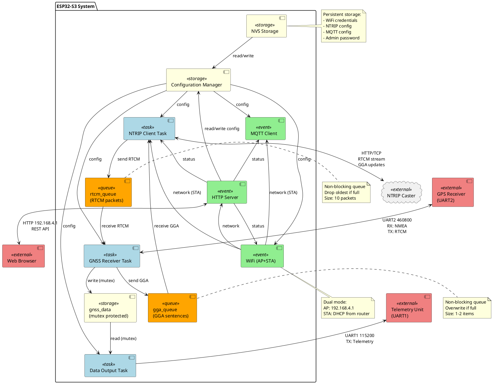

# ESP32-S3 Multi-Task System Architecture

## System Overview

This design describes a comprehensive ESP32-S3 based system that combines real-time embedded control with web-based configuration management. The system operates in dual WiFi mode (AP+STA), providing both internet connectivity and a persistent configuration interface. At its core, the architecture features a thread-safe configuration manager backed by NVS (Non-Volatile Storage) that coordinates settings across multiple subsystems including WiFi connectivity, NTRIP client for GPS corrections, MQTT client for data publishing, GPS receiver communication, telemetry data output, and a web server for user configuration. The system leverages FreeRTOS for task management, running dedicated tasks for NTRIP streaming, GPS receiver communication, and telemetry data output, while WiFi and MQTT utilize event-driven architectures with built-in task management. User configuration is accessible via a web interface served on the persistent Access Point (192.168.4.1), while internet services operate through the Station mode connection to the user's router. All components communicate through FreeRTOS primitives (queues, mutexes, event groups) ensuring thread-safe operation and efficient resource utilization across both CPU cores of the ESP32-S3.

---

## PlantUML Component Diagram



### Diagram Legend:

- **Blue Components (<<task>>)**: FreeRTOS tasks with dedicated execution contexts
- **Green Components (<<event>>)**: Event-driven components with internal tasks
- **Yellow Components (<<storage>>)**: Storage and configuration management
- **Coral Components (<<external>>)**: External hardware/services
- **Orange Queues**: FreeRTOS queues for inter-task communication
- **Solid arrows**: Data/control flow
- **Dashed lines**: Configuration/status queries

### Key Dataflows:

1. **RTCM Corrections Flow**: NTRIP Caster → NTRIP Task → rtcm_queue → GNSS Task → GPS Receiver (UART2)
2. **GGA Position Flow**: GPS Receiver → GNSS Task → gga_queue → NTRIP Task → NTRIP Caster
3. **Position Output Flow**: GPS Receiver → GNSS Task → gnss_data (mutex) → Data Output Task → Telemetry Unit (UART1)
4. **Configuration Flow**: Web Browser → HTTP Server → Config Manager → NVS

---

For a multi-task ESP32 system with web-based configuration, here's the best architectural approach:

Recommended Architecture:

# 1. Configuration Storage Layer

┌─────────────────────────────────────┐
│   NVS (Non-Volatile Storage)        │ ← Persistent storage
└─────────────────────────────────────┘
           ↕ (Read/Write)
┌─────────────────────────────────────┐
│  Configuration Manager Module       │ ← Centralized config
│  - Thread-safe access (mutex)       │
│  - Get/Set functions                │
│  - Validation                       │
│  - Notify subscribers on changes    │
└─────────────────────────────────────┘
   ↕         ↕         ↕         ↕           ↕
[WiFi]  [NTRIP]   [MQTT]  [Web Server]  [GNSS/Data Output]
          ↕                               ↕
    [rtcm_queue]                   [gnss_data (mutex)]
    [gga_queue]                    [Data Output Task]

# 2. Implementation Strategy

Configuration Manager (config.h/cpp):

 - Single source of truth for all settings
 - Struct-based configuration:
	```c
	typedef struct {
		char ssid[32];
		char password[64];
	} wifi_config_t;
	
	typedef struct {
		char host[128];
		uint16_t port;
		char mountpoint[64];
		char user[32];
		char password[64];
		uint16_t gga_interval_sec;     // Default: 120
		uint16_t reconnect_delay_sec;  // Default: 5
		bool enabled;                  // Default: true
	} ntrip_config_t;
	
	typedef struct {
		char broker[128];
		uint16_t port;
		char topic[64];
		char user[32];
		char password[64];
		uint16_t gnss_interval_sec;    // Default: 10
		uint16_t status_interval_sec;  // Default: 120
		uint16_t stats_interval_sec;   // Default: 60
		bool enabled;                  // Default: true
	} mqtt_config_t;
	
	typedef struct {
		wifi_config_t wifi;
		ntrip_config_t ntrip;
		mqtt_config_t mqtt;
	} app_config_t;
	```

JSON Configuration Format:
	```json
	{
		"wifi": {
			"ssid": "ssid",
			"password": "wifi_password"
		},
		"ntrip": {
			"host": "host",
			"port": 2101,
			"mountpoint": "mountpoint",
			"user": "ntrip_user",
			"password": "ntrip_user_password",
			"gga_interval_sec": 120,
			"reconnect_delay_sec": 5,
			"enabled": true
		},
		"mqtt": {
			"broker": "broker",
			"port": 1883,
			"topic": "ntripclient",
			"user": "mqtt_user",
			"password": "mqtt_user_password",
			"gnss_interval_sec": 10,
			"status_interval_sec": 120,
			"stats_interval_sec": 60,
			"enabled": true
		}
	}
	```

Thread-Safe Access:

 - Use FreeRTOS mutex for config access Getter/setter functions only
 - No direct struct access from tasks 

Event Notifications:

 - Use FreeRTOS event groups or task notifications
 - When config changes via web, notify affected tasks
 - Tasks can reinitialize/reconnect as needed
 - **Task Restart Capability**: NTRIP Client, MQTT Client, and Data Output Task monitor configuration changes and can be:
   - **Disabled/Enabled**: Set `enabled` flag to false to stop task operation
   - **Restarted**: When configuration parameters change, tasks automatically disconnect and reconnect with new settings
   - **Default State**: All tasks enabled by default

# 3. Technology Stack

## WiFi Configuration - Persistent AP+STA Mode

The ESP32 will operate in **AP+STA (Access Point + Station) mode simultaneously**:

### Access Point (AP) Mode:
 - **SSID**: "ESP32-Config" (or customizable)
 - **Password**: WPA2-PSK protected
 - **IP Address**: 192.168.4.1 (default gateway)
 - **Purpose**: Always-accessible configuration interface
 - **Max Connections**: 4 concurrent clients

### Station (STA) Mode:
 - **Purpose**: Connects to user's WiFi router for internet access
 - **DHCP**: Obtains IP from router
 - **Services**: MQTT client, NTRIP client connectivity
 - **Fallback**: If STA connection fails, AP remains accessible

### Configuration Flow:
```
1. User connects device to "ESP32-Config" WiFi (192.168.4.1)
2. Access web interface to configure WiFi credentials
3. ESP32 connects to user's router (STA) while keeping AP active
4. Configuration always accessible via AP (192.168.4.1)
5. Internet services run through STA connection
```

### Technical Details:
 - **WiFi Mode**: `WIFI_MODE_APSTA`
 - **Channel**: AP operates on same channel as STA connection
 - **IP Routing**: Two separate network interfaces (AP and STA)
 - **Captive Portal**: Optional DNS redirect for easier discovery

## Web Server Architecture

The ESP32 HTTP server provides both static content delivery and a REST API for configuration management.

### Server Configuration:
```c
httpd_config_t config = HTTPD_DEFAULT_CONFIG();
config.server_port = 80;
config.max_uri_handlers = 10;
config.max_open_sockets = 7;
config.stack_size = 4096;
httpd_start(&server, &config);
```

### Static Content Endpoints:

| Method | Endpoint | Description | Content-Type |
|--------|----------|-------------|--------------|
| GET | `/` | Main configuration page | text/html |
| GET | `/style.css` | Stylesheet | text/css |
| GET | `/app.js` | JavaScript application | application/javascript |
| GET | `/favicon.ico` | Browser icon | image/x-icon |

### REST API Endpoints:

#### Configuration Management:

**GET /api/config**
- **Purpose**: Retrieve current system configuration
- **Response**: JSON object with wifi, ntrip, and mqtt settings
- **Example Response**:
```json
{
    "wifi": {
        "ssid": "MyNetwork",
        "password": "********"
    },
    "ntrip": {
        "host": "rtk2go.com",
        "port": 2101,
        "mountpoint": "MyMount",
        "user": "user",
        "password": "********",
        "gga_interval_sec": 120,
        "reconnect_delay_sec": 5,
        "enabled": true
    },
    "mqtt": {
        "broker": "mqtt.example.com",
        "port": 1883,
        "topic": "ntripclient",
        "user": "mqttuser",
        "password": "********",
        "gnss_interval_sec": 10,
        "status_interval_sec": 120,
        "stats_interval_sec": 60,
        "enabled": true
    }
}
```

**POST /api/config**
- **Purpose**: Update system configuration
- **Content-Type**: application/json
- **Request Body**: Same structure as GET response
- **Response Codes**:
  - `200 OK`: Configuration updated successfully
  - `400 Bad Request`: Invalid JSON or missing required fields
  - `500 Internal Server Error`: Failed to save to NVS
- **Example Request**:
```json
{
    "wifi": {
        "ssid": "NewNetwork",
        "password": "newpassword"
    }
}
```
- **Example Success Response**:
```json
{
    "status": "ok",
    "message": "Configuration updated successfully"
}
```
- **Example Error Response**:
```json
{
    "status": "error",
    "message": "Invalid WiFi SSID length"
}
```

#### System Status:

**GET /api/status**
- **Purpose**: Get real-time system status
- **Response**: Current connection states and system health
- **Example Response**:
```json
{
    "wifi": {
        "ap_enabled": true,
        "sta_connected": true,
        "sta_ip": "192.168.1.100",
        "rssi": -45
    },
    "ntrip": {
        "connected": true,
        "bytes_received": 123456
    },
    "mqtt": {
        "connected": true,
        "messages_published": 42
    },
    "system": {
        "uptime_sec": 3600,
        "free_heap": 125000
    }
}
```

#### System Control:

**POST /api/restart**
- **Purpose**: Restart the ESP32 device
- **Response**: Confirmation before restart
- **Example Response**:
```json
{
    "status": "ok",
    "message": "Device restarting in 3 seconds"
}
```

**POST /api/factory_reset**
- **Purpose**: Clear all configuration and restart
- **Response**: Confirmation before reset
- **Example Response**:
```json
{
    "status": "ok",
    "message": "Factory reset initiated"
}
```

### Web Interface Implementation:

**User Workflow**:
```
1. User opens browser → http://192.168.4.1
2. ESP32 serves HTML configuration form
3. JavaScript loads current config via GET /api/config
4. User modifies WiFi/MQTT/NTRIP settings in form
5. JavaScript validates input client-side
6. JavaScript POSTs to /api/config with JSON data
7. ESP32 validates, saves to NVS, notifies affected tasks
8. JavaScript displays success/error message
9. Page polls /api/status for real-time connection updates
```

### HTTP Handler Registration:

```c
// Static content
httpd_uri_t uri_root = {
    .uri = "/",
    .method = HTTP_GET,
    .handler = root_get_handler
};
httpd_register_uri_handler(server, &uri_root);

// REST API
httpd_uri_t uri_api_config_get = {
    .uri = "/api/config",
    .method = HTTP_GET,
    .handler = api_config_get_handler
};
httpd_register_uri_handler(server, &uri_api_config_get);

httpd_uri_t uri_api_config_post = {
    .uri = "/api/config",
    .method = HTTP_POST,
    .handler = api_config_post_handler
};
httpd_register_uri_handler(server, &uri_api_config_post);
```

### Security Considerations:

 - **HTTP Basic Authentication**: Required for all configuration endpoints
   - **Default Credentials**: Username: `admin`, Password: `admin`
   - **Configurable**: Credentials can be changed via web interface
   - **Storage**: Hashed password stored in NVS
   - **Protected Endpoints**: `/api/config` (POST), `/api/restart`, `/api/factory_reset`
   - **Public Endpoints**: `/` (login page), `/api/status` (read-only)
   - **Implementation**: ESP-IDF httpd basic auth or custom middleware
   - **Header Format**: `Authorization: Basic base64(username:password)`
   - **Failed Attempts**: Log failed authentication attempts
   - **Security Warning**: Users must change default credentials on first use
 - **Password Masking**: Passwords returned as "********" in GET /api/config requests
 - **Input Validation**: All inputs validated before saving to NVS
 - **CORS**: Not required (same-origin policy applies)
 - **Rate Limiting**: Prevent rapid configuration updates and brute-force attacks
 - **HTTPS**: Optional for production (requires certificate management)

### Web UI Technology Stack:

 - **HTML5**: Structure and forms
 - **CSS3**: Styling and responsive design
 - **Vanilla JavaScript**: AJAX requests, DOM manipulation
 - **No external libraries**: All code embedded, no CDN dependencies
 - **Embedded files**: HTML/CSS/JS embedded in firmware or served from LittleFS

## Storage

 - **NVS**: Configuration persistence with wear leveling
 - **Default values**: Compiled in if NVS empty
 - **Factory reset**: Function to restore defaults and clear NVS
 - **Namespaces**: Separate NVS namespaces for wifi, ntrip, mqtt configs

# 4. Workflow Example

User → Web Page → HTTP POST /api/config
                      ↓
                Config Manager validates
                      ↓
                Save to NVS
                      ↓
                Set event flag
                      ↓
           [WiFi Task wakes, sees flag]
                      ↓
           Disconnect, read new config, reconnect


# 5. Best Practices

Separation of Concerns:

 - Config module knows nothing about WiFi/MQTT internals
 - Each task module handles its own initialization from config
 - Web server only reads/writes config, doesn't manage tasks

Validation:

 - Validate on web submission (client-side)
 - Re-validate in config manager (server-side)
 - Don't allow invalid values into NVS

Error Handling:

 - If new config fails (e.g., bad WiFi credentials), keep old config
 - Option to revert to last working config
 - Timeout-based rollback

Security:

 - Basic authentication for web interface
 - HTTPS if handling sensitive data
 - Rate limiting on config endpoints

# 6. ESP-IDF Components You'll Need

 - nvs_flash - Configuration persistence
 - esp_http_server - Web server
 - cJSON - JSON parsing for REST API
 - esp_wifi - WiFi management (AP+STA mode)
 - esp_netif - Network interface abstraction (AP and STA interfaces)
 - mqtt_client - MQTT connectivity
 - FreeRTOS mutexes/events - Thread synchronization
 - driver/uart - Serial communication for GNSS and data output

# 7. Task Architecture

### Event-Driven Components (No dedicated tasks needed):
 - **WiFi**: Event loop system handles connection/disconnection
 - **MQTT Client**: Built-in task created by library
 - **HTTP Server**: Internal tasks handle requests

### Dedicated Tasks Required:

#### Core System Tasks:
 - **NTRIP Client Task**: Streaming protocol requires persistent connection
 - **GNSS Receiver Task**: Handles bidirectional GPS communication
 - **Data Output Task**: Formats and transmits telemetry data

### Task Detailed Specifications:

---

## NTRIP Client Task

**Purpose**: Establish and maintain persistent connection to NTRIP caster to receive RTCM correction data for RTK positioning.

**Runtime Control**: 
- **Enabled by default** - can be disabled via configuration (`enabled` flag)
- **Automatic restart** - when configuration changes, task disconnects and reconnects with new settings
- **Graceful shutdown** - when disabled, cleanly closes connection and stops operation

### Configuration:
- **Protocol**: HTTP/1.1 over TCP
- **Port**: Typically 2101 (configurable)
- **Reconnection**: Auto-reconnect on disconnect with exponential backoff
- **GGA Update Interval**: 120 seconds (configurable, sync with GNSS task)
- **Buffer Size**: 2048 bytes for RTCM stream

### NTRIP Protocol Implementation:

The NTRIP (Networked Transport of RTCM via Internet Protocol) client implements HTTP-based streaming:

**Connection Request Format**:
```http
GET /[mountpoint] HTTP/1.1
Host: [host]:[port]
User-Agent: NTRIP ESP32Client/1.0
Authorization: Basic [base64(user:password)]
Ntrip-Version: Ntrip/2.0
Connection: close

```

**Expected Response**:
```http
HTTP/1.1 200 OK
Content-Type: gnss/data
```

### Responsibilities:

**Connection Management**:
1. Read NTRIP configuration from NVS (host, port, mountpoint, user, password)
2. Establish TCP connection to NTRIP caster
3. Send HTTP GET request with authentication headers
4. Validate HTTP 200 OK response
5. Maintain persistent connection for RTCM streaming
6. Handle disconnections with retry logic (exponential backoff: 1s, 2s, 4s, max 60s)

**RTCM Data Reception**:
1. Continuously read RTCM binary stream from caster
2. Buffer RTCM packets (typically 20-500 bytes each)
3. Send complete RTCM packets to GNSS Receiver Task via `rtcm_queue`
4. Monitor data rate (typical 50-200 bytes/sec)
5. Log connection status and data statistics

**GGA Position Updates**:
1. Receive GGA sentences from GNSS Receiver Task via `gga_queue`
2. Send GGA to NTRIP caster at configured interval (default 120 seconds)
3. Format: `$GPGGA,...*checksum\r\n` sent as HTTP body
4. Some casters require GGA for authentication or optimized corrections

**Error Handling**:
- HTTP 401/403: Invalid credentials → notify user, stop retries
- HTTP 404: Invalid mountpoint → log error, retry with backoff
- Timeout: No data for 30 seconds → reconnect
- Network loss: Detect WiFi disconnect event, wait for reconnection

### Data Structures:

**Configuration:** See `ntrip_config_t` defined in Configuration Manager section.

**Runtime Status:**
```c
typedef struct {
    bool connected;
    uint32_t bytes_received;
    uint32_t rtcm_packets_sent;
    uint32_t gga_updates_sent;
    time_t last_data_time;
    char last_error[64];
} ntrip_status_t;

typedef struct {
    uint8_t data[512];
    size_t length;
} rtcm_packet_t;
```

### Queues:
- **rtcm_queue** (output): Sends RTCM packets to GNSS Receiver Task
  - Type: `rtcm_packet_t`
  - Size: 10 items
  - Blocking: **No** - Drop oldest if full (newer data prioritized)
  - Strategy: If queue full, remove oldest item and add new one
  - Rationale: RTCM corrections are time-sensitive; fresh data more valuable than stale
  
- **gga_queue** (input): Receives GGA sentences from GNSS Receiver Task
  - Type: `char[128]`
  - Size: 2 items
  - Blocking: **No** - Overwrite if full
  - Strategy: Only latest GGA position needed for caster updates

### Queue Creation and Initialization:

```c
// Create queues in main initialization
QueueHandle_t rtcm_queue;
QueueHandle_t gga_queue;

void initQueues(void) {
    // RTCM queue: 10 packets deep for buffering bursts
    rtcm_queue = xQueueCreate(10, sizeof(rtcm_packet_t));
    if (rtcm_queue == NULL) {
        ESP_LOGE(TAG, "Failed to create rtcm_queue");
    }
    
    // GGA queue: Only 1 item needed (always latest position)
    // Using size 2 for safety/flexibility
    gga_queue = xQueueCreate(2, 128); // 128 bytes for GGA string
    if (gga_queue == NULL) {
        ESP_LOGE(TAG, "Failed to create gga_queue");
    }
}
```

**Alternative: Using xQueueOverwrite() for GGA Queue:**

For `gga_queue`, since only the latest GGA is needed, consider using `xQueueOverwrite()`:

```c
// Create as queue of length 1
gga_queue = xQueueCreate(1, 128);

// In GNSS Receiver Task - always overwrite with latest
xQueueOverwrite(gga_queue, gga_buffer);  // Replaces existing item

// In NTRIP Client Task - always read latest
if (xQueuePeek(gga_queue, gga_buffer, 0) == pdTRUE) {
    sendGGA(gga_buffer);
}
```

This eliminates the need to manually drop items for the GGA queue.

### Arduino Framework Integration (Current Code):

The existing `NTRIPClient` class provides the core functionality:

```cpp
// From NTRIPClient.h (Arduino-based, requires porting to ESP-IDF)
class NTRIPClient : public WiFiClient {
    // Request RAW data from NTRIP Caster
    bool reqRaw(const char* host, int &port, const char* mntpnt, 
                const char* user, const char* psw);
    
    // Send GGA sentence to NTRIP Caster
    void sendGGA(const char* gga);
    
    // Read line from caster
    int readLine(char* buffer, int size);
    
    // Request source table (for debugging/discovery)
    bool reqSrcTbl(const char* host, int &port, 
                   const char* user, const char* psw);
};
```

### Task Loop Structure:

```c
void vNTRIPClientTask(void *pvParameters) {
    ntrip_config_t config;
    rtcm_packet_t rtcm_packet;
    char gga_buffer[128];
    TickType_t last_gga_time = 0;
    
    // Load configuration from NVS
    loadNTRIPConfig(&config);
    
    while (1) {
        // Establish connection
        if (!ntripConnect(&config)) {
            vTaskDelay(pdMS_TO_TICKS(reconnect_delay * 1000));
            continue;
        }
        
        ESP_LOGI(TAG, "NTRIP connected to %s:%d/%s", 
                 config.host, config.port, config.mountpoint);
        
        // Main streaming loop
        while (connected) {
            // Check for GGA updates from queue
            if (xQueueReceive(gga_queue, gga_buffer, 0) == pdTRUE) {
                sendGGA(gga_buffer);
                last_gga_time = xTaskGetTickCount();
            }
            
            // Send periodic GGA if interval elapsed
            if ((xTaskGetTickCount() - last_gga_time) > 
                pdMS_TO_TICKS(config.gga_interval_sec * 1000)) {
                if (xQueuePeek(gga_queue, gga_buffer, 0) == pdTRUE) {
                    sendGGA(gga_buffer);
                    last_gga_time = xTaskGetTickCount();
                }
            }
            
            // Read RTCM data from stream
            if (available()) {
                rtcm_packet.length = read(rtcm_packet.data, 
                                         sizeof(rtcm_packet.data));
                if (rtcm_packet.length > 0) {
                    // Send to GNSS receiver via queue (non-blocking)
                    // If queue full, drop oldest and add new
                    if (xQueueSend(rtcm_queue, &rtcm_packet, 0) != pdTRUE) {
                        // Queue full - remove oldest item
                        rtcm_packet_t dummy;
                        xQueueReceive(rtcm_queue, &dummy, 0);
                        // Add new item
                        xQueueSend(rtcm_queue, &rtcm_packet, 0);
                        ESP_LOGW(TAG, "RTCM queue full, dropped oldest packet");
                    }
                }
            } else {
                // No data, check timeout
                if ((xTaskGetTickCount() - last_data_time) > 
                    pdMS_TO_TICKS(30000)) {
                    ESP_LOGW(TAG, "NTRIP timeout, reconnecting");
                    break; // Reconnect
                }
                vTaskDelay(pdMS_TO_TICKS(100));
            }
        }
        
        // Disconnected, cleanup and retry
        ntripDisconnect();
        vTaskDelay(pdMS_TO_TICKS(5000));
    }
}
```

### ESP-IDF Porting Requirements:

The current `NTRIPClient` code uses Arduino framework and requires porting to ESP-IDF:

**Required Changes**:
1. **WiFiClient → ESP-IDF HTTP Client**:
   - Replace `WiFiClient` with `esp_http_client` or raw sockets
   - Use `esp_http_client_open()`, `esp_http_client_read()`, `esp_http_client_write()`
   
2. **Base64 Encoding**:
   - Replace Arduino `base64.h` with ESP-IDF `mbedtls/base64.h`
   - Use `mbedtls_base64_encode()` for authentication header
   
3. **String Handling**:
   - Replace Arduino `String` with C strings and `snprintf()`
   - Use ESP-IDF logging (`ESP_LOGI`, `ESP_LOGW`, `ESP_LOGE`)
   
4. **FreeRTOS Integration**:
   - Wrap in FreeRTOS task function
   - Add queue communication
   - Use `vTaskDelay()` instead of `delay()`

**Alternative: Use Arduino Framework on ESP-IDF**:
- Configure PlatformIO/ESP-IDF to use Arduino as a component
- Minimal code changes required
- Keep existing `NTRIPClient` implementation
- Still requires FreeRTOS task wrapper and queue integration

### HTTP Client Configuration (ESP-IDF):

```c
esp_http_client_config_t http_config = {
    .url = ntrip_url,  // "http://host:port/mountpoint"
    .method = HTTP_METHOD_GET,
    .timeout_ms = 10000,
    .buffer_size = 2048,
    .disable_auto_redirect = true,
};

esp_http_client_handle_t client = esp_http_client_init(&http_config);

// Add authentication header
char auth_header[256];
sprintf(auth_header, "%s:%s", config.user, config.password);
char auth_encoded[256];
mbedtls_base64_encode(auth_encoded, sizeof(auth_encoded), 
                      &out_len, (uint8_t*)auth_header, strlen(auth_header));

char auth_full[300];
sprintf(auth_full, "Basic %s", auth_encoded);
esp_http_client_set_header(client, "Authorization", auth_full);
esp_http_client_set_header(client, "Ntrip-Version", "Ntrip/2.0");
```

### Implementation Notes:
- RTCM3 messages are binary, handle as raw bytes
- Don't parse RTCM content, forward directly to GNSS receiver
- Log first few bytes of RTCM for debugging: message type typically 0xD3
- Monitor WiFi status via event loop, suspend during WiFi disconnect
- Consider adding sourcetable request (`reqSrcTbl`) for configuration UI

---

## GNSS Receiver Task

**Purpose**: Bidirectional serial communication with GPS receiver for RTK corrections and position data.

### Configuration:
- **UART Port**: UART2 (Serial2)
- **Baud Rate**: 460800 bps
- **Data Bits**: 8
- **Stop Bits**: 1
- **Parity**: None (8N1)
- **Flow Control**: None
- **TX Pin**: GPIO 17 (fixed)
- **RX Pin**: GPIO 18 (fixed)
- **Buffer Size**: 2048 bytes RX, 1024 bytes TX

### Responsibilities:

**Input Processing (GPS → ESP32)**:
1. Continuously read NMEA sentences from GPS receiver
2. Parse and validate NMEA messages (checksum verification)
3. Extract and store data from the following sentences:
   - **GGA** (Global Positioning System Fix Data): lat, lon, alt, fix quality, satellites, HDOP, DGPS age
   - **RMC** (Recommended Minimum Specific GNSS Data): date, time, lat, lon, speed, course
   - **VTG** (Track Made Good and Ground Speed): true heading, ground speed
4. **Centralized Parsing and Conversion**:
   - Convert NMEA coordinates (DDMM.MMMMM) to decimal degrees (DD.DDDDDDD)
   - Convert speed from knots to m/s
   - Format date/time as ISO 8601 string
   - Store all parsed data in `gnss_data_t` structure
5. Provide thread-safe access to parsed GNSS data via mutex-protected getters
6. Store raw NMEA sentences for reference (GGA for NTRIP Client)

**Output Processing (ESP32 → GPS)**:
1. Receive RTCM correction packets from NTRIP Client Task via queue
2. Forward RTCM data to GPS receiver via UART2 TX
3. Monitor transmission success

**NTRIP Integration**:
- Send GGA sentence to NTRIP Client Task at configurable intervals
- **Default Interval**: 120 seconds (2 minutes)
- **Configurable Range**: 10-600 seconds
- **Configuration Storage**: NVS (`gga_interval_sec`)
- Use FreeRTOS timer or `vTaskDelay` for interval management

### Data Structures:

```c
typedef struct {
    // Raw NMEA sentences (for reference/logging)
    char gga[128];      // Latest GGA sentence
    char rmc[128];      // Latest RMC sentence
    char vtg[128];      // Latest VTG sentence
    
    // Parsed position data (ready for consumption by other tasks)
    double latitude;           // Decimal degrees (DD.DDDDDDD)
    double longitude;          // Decimal degrees (DD.DDDDDDD)
    float altitude;            // Meters above sea level
    float speed;               // Ground speed in m/s (converted from knots)
    float heading;             // True heading in degrees (0-359.99)
    
    // Fix quality indicators
    uint8_t fix_quality;       // GGA field 6: 0=no fix, 1=GPS, 2=DGPS, 4=RTK fixed, 5=RTK float
    uint8_t satellites;        // Number of satellites in fix
    float hdop;                // Horizontal dilution of precision
    float dgps_age;            // Age of differential corrections in seconds
    
    // Timestamp
    char datetime_iso8601[32]; // ISO 8601 format: "YYYY-MM-DD HH:mm:ss.SSS"
    time_t timestamp;          // Last update time (system time)
    bool valid;                // Data validity flag
} gnss_data_t;

typedef struct {
    uint16_t gga_interval_sec;
} gnss_config_t;

// Fixed UART2 configuration:
// - Baud: 460800
// - TX: GPIO 17
// - RX: GPIO 18
```

### Queues:
- **rtcm_queue**: Receives RTCM packets from NTRIP Client (input)
- **gga_queue**: Sends GGA to NTRIP Client (output)

### NMEA Parsing Implementation:

**Coordinate Conversion** (NMEA DDMM.MMMMM → Decimal Degrees DD.DDDDDDD):
```c
// Example: GGA latitude = "5212.688959,N" → 52.211483
// Example: GGA longitude = "00559.0198035,E" → 5.983663

double nmea_to_decimal_degrees(double nmea_value, char direction) {
    int degrees = (int)(nmea_value / 100.0);
    double minutes = nmea_value - (degrees * 100.0);
    double decimal = degrees + (minutes / 60.0);
    
    // Apply hemisphere sign
    if (direction == 'S' || direction == 'W') {
        decimal = -decimal;
    }
    return decimal;
}
```

**Speed Conversion** (Knots → m/s):
```c
float speed_ms = speed_knots * 0.514444;
```

**ISO 8601 Date-Time Formatting**:
```c
// From RMC date (DDMMYY) and time (HHMMSS.sss)
// Format: "2025-03-28 10:27:06.200"
sprintf(gnss_data.datetime_iso8601, "%04d-%02d-%02d %02d:%02d:%02d.%03d",
        year, month, day, hour, minute, second, millisecond);
```

### Implementation Notes:
- Use UART event queue for efficient RX processing
- Implement NMEA sentence parsing and checksum validation
- Handle partial sentences and buffer overflow gracefully
- **All NMEA parsing done once in this task** - other tasks consume pre-parsed data
- Update `gnss_data` structure atomically with mutex protection
- Log GNSS status (fix quality, satellites, HDOP)

---

## Data Output Task

**Purpose**: Format and transmit telemetry data (position, time, navigation) to external telemetry unit.

**Runtime Control**: 
- **Enabled by default** - can be disabled via configuration (`enabled` flag)
- **Automatic restart** - when configuration changes (e.g., output interval), task restarts with new settings
- **Graceful shutdown** - when disabled, stops transmission cleanly

### Configuration:
- **UART Port**: UART1 (Serial1)
- **Baud Rate**: 115200 bps
- **Data Bits**: 8
- **Stop Bits**: 1
- **Parity**: None (8N1)
- **Flow Control**: None
- **TX Pin**: GPIO 15 (fixed)
- **RX Pin**: GPIO 16 (fixed, not used for TX-only operation)
- **Output Interval**: 100 ms (10 Hz)
- **Buffer Size**: 512 bytes TX

### Output Format:

**Protocol Structure**:
The output uses a binary framing protocol with byte stuffing for data transparency.

**Message Format**:
```
[Control-A] [Message Data (stuffed)] [CRC-16 High (stuffed)] [CRC-16 Low (stuffed)] [Control-X]
```

**Framing Bytes**:
- **Control-A (SOH)**: 0x01 - Start of message
- **Control-X (CAN)**: 0x18 - End of message
- **Escape (DLE)**: 0x10 - Byte stuffing escape character

**Byte Stuffing Rules**:
If any byte in the message data or CRC-16 equals 0x01, 0x18, or 0x10, insert escape byte (0x10) before it.

**Message String Structure** (before framing):
```
YYYY-MM-DD HH:mm:ss.sss,LAT,LON,ALT,HEADING,SPEED
```

**Date-Time Format**:
Follows **ISO 8601** standard:
- **YYYY-MM-DD HH:mm:ss.sss**
- **YYYY**: 4-digit year (e.g., 2026)
- **MM**: 2-digit month (01-12)
- **DD**: 2-digit day (01-31)
- **HH**: 2-digit hour in 24-hour format (00-23)
- **mm**: 2-digit minutes (00-59)
- **ss**: 2-digit seconds (00-59)
- **sss**: 3-digit milliseconds (000-999)

**Field Definitions**:
- **LAT**: Decimal degrees, signed (e.g., -34.123456)
- **LON**: Decimal degrees, signed (e.g., 150.987654)
- **ALT**: Altitude in meters (e.g., 123.45)
- **HEADING**: True heading in degrees (0-359.99)
- **SPEED**: Ground speed in km/h (e.g., 45.67)

**Example Raw Message String**:
```
2026-01-10 14:30:52.123,-34.123456,150.987654,123.45,270.15,45.67
```

**Example Complete Frame** (hex representation, assuming CRC = 0xA3B2):
```
01 31 30 30 31 32 36 2C 31 34 33 30 35 32 2E 31 32 33 2C ... A3 B2 18
^  [-------- Message Data (with stuffing if needed) --------] [CRC] ^
SOH                                                                  CAN
```

If CRC high byte (0xA3) or low byte (0xB2) were 0x01, 0x10, or 0x18, they would be preceded by 0x10.

### CRC-16 Calculation:
- **Algorithm**: CRC-16/CCITT-FALSE
- **Polynomial**: 0x1021
- **Initial Value**: 0xFFFF
- **XOR Out**: 0x0000
- **Calculated Over**: Message string only (not including framing bytes)
- **Byte Order**: Big-endian (high byte first)

### Data Source:
- Retrieve latest GNSS data from GNSS Receiver Task via `gnss_get_data()` with mutex
- All NMEA parsing performed centrally in GNSS Receiver Task
- Data already in required format (decimal degrees, m/s, ISO 8601)
- Handle missing or invalid data gracefully (check `valid` flag)

### Data Structures:

```c
typedef struct {
    uint32_t interval_ms;
    bool enabled;  // Default: true
} data_output_config_t;

// Fixed UART1 configuration:
// - Baud: 115200
// - TX: GPIO 15
// - RX: GPIO 16 (unused)

typedef struct {
    uint8_t day, month, year;
    uint8_t hour, minute, second;
    uint16_t millisecond;
    double latitude;
    double longitude;
    float altitude;
    float heading;
    float speed;
} position_data_t;
```

### Implementation Notes:
- Use `vTaskDelay(pdMS_TO_TICKS(100))` for 100ms interval
- Format output using `snprintf` for precision control
- Calculate CRC before adding to string
- Handle invalid/unavailable data with default values (e.g., 0.0)
- Log transmission errors
- Optional: Add data valid flag to output if GNSS has no fix

---

## LED Indicator Task

**Purpose**: Control visual status indicators for system components including WiFi connectivity, NTRIP connection, MQTT status, GPS fix quality, and general system status via RGB LED.

**Runtime Control**: 
- **Always enabled** - provides critical visual feedback for system status
- **No configuration needed** - operates autonomously based on system state
- **Automatic updates** - monitors status changes from all subsystems in real-time

### Configuration:
- **Update Rate**: 100 ms (10 Hz for smooth blinking)
- **Blink Rate**: 500 ms period (1 Hz) for activity indicators
- **LED Pins**: Defined in hardware_config.h
  - WiFi LED: GPIO 46
  - NTRIP LED: GPIO 9
  - MQTT LED: GPIO 10
  - FIX_RTK_LED: GPIO 12
  - FIX_RTKFLOAT_LED: GPIO 11
  - Neopixel RGB LED: GPIO 38 (Lolin S3 built-in)

### Responsibilities:

**WiFi Status Indication**:
- **ON (solid)**: STA mode connected to WiFi router
- **OFF**: STA mode disconnected or attempting connection
- Monitor: WiFi event notifications from WiFi Manager

**NTRIP Status Indication**:
- **OFF**: NTRIP client disabled or disconnected
- **ON (solid)**: Connected to NTRIP caster, no recent data
- **BLINK**: Connected and actively receiving RTCM packets
- Blink trigger: RTCM data received within last 2 seconds
- Monitor: NTRIP client connection status and RTCM packet timestamps

**MQTT Status Indication**:
- **OFF**: MQTT client disabled or disconnected
- **ON (solid)**: Connected to broker, idle
- **BLINK**: Message sent or received within last 2 seconds
- Blink trigger: MQTT publish/subscribe activity
- Monitor: MQTT client connection status and message events

**GPS Fix Quality Indication (FIX_RTK_LED)**:
- **OFF**: No GPS fix (quality 0) or invalid data
- **ON (solid)**: Valid GPS coordinate received (quality >= 1)
- Indicates: Basic GPS fix, DGPS, or any RTK mode
- Monitor: GGA sentence fix quality field

**RTK Fix Status Indication (FIX_RTKFLOAT_LED)**:
- **OFF**: No RTK solution (quality < 2)
- **BLINK**: RTK Float fix (quality 2) - partial RTK convergence
- **ON (solid)**: RTK Fixed solution (quality 4 or 5) - full RTK accuracy
- Blink rate: 1 Hz (500ms on/off) for RTK Float
- Monitor: GGA sentence fix quality field

**Neopixel RGB LED (General Status)**:
- **OFF**: System initializing or error state
- **GREEN**: System operating normally, all configured services running
- **YELLOW**: Partial operation (e.g., WiFi connected but NTRIP/MQTT disabled)
- **RED**: Critical error or configuration issue
- **BLUE (pulsing)**: Firmware update in progress (future feature)
- Monitor: Overall system health from all subsystems

### Data Structures:

```c
typedef struct {
    bool wifi_sta_connected;
    bool ntrip_connected;
    bool ntrip_data_activity;      // RTCM received in last 2 seconds
    bool mqtt_connected;
    bool mqtt_activity;             // Message sent/received in last 2 seconds
    uint8_t gps_fix_quality;        // 0=no fix, 1=GPS, 2=DGPS, 4=RTK fixed, 5=RTK float
    bool gps_data_valid;            // Valid GGA data available
    time_t last_ntrip_data_time;
    time_t last_mqtt_activity_time;
} led_status_t;

typedef enum {
    LED_OFF = 0,
    LED_ON = 1,
    LED_BLINK = 2
} led_state_t;

typedef struct {
    uint8_t r;
    uint8_t g;
    uint8_t b;
} rgb_color_t;

// Predefined colors for Neopixel status
#define RGB_OFF         {0, 0, 0}
#define RGB_GREEN       {0, 255, 0}
#define RGB_YELLOW      {255, 255, 0}
#define RGB_RED         {255, 0, 0}
#define RGB_BLUE        {0, 0, 255}
```

### LED State Logic:

**WiFi LED Logic**:
```c
wifi_led_state = wifi_sta_connected ? LED_ON : LED_OFF;
```

**NTRIP LED Logic**:
```c
if (!ntrip_connected) {
    ntrip_led_state = LED_OFF;
} else if (time_since_last_rtcm < 2000ms) {
    ntrip_led_state = LED_BLINK;
} else {
    ntrip_led_state = LED_ON;
}
```

**MQTT LED Logic**:
```c
if (!mqtt_connected) {
    mqtt_led_state = LED_OFF;
} else if (time_since_last_mqtt_activity < 2000ms) {
    mqtt_led_state = LED_BLINK;
} else {
    mqtt_led_state = LED_ON;
}
```

**FIX_RTK_LED Logic**:
```c
fix_rtk_led_state = (gps_data_valid && gps_fix_quality >= 1) ? LED_ON : LED_OFF;
```

**FIX_RTKFLOAT_LED Logic**:
```c
if (gps_fix_quality == 2) {
    fix_rtkfloat_led_state = LED_BLINK;  // RTK Float
} else if (gps_fix_quality >= 4) {
    fix_rtkfloat_led_state = LED_ON;     // RTK Fixed
} else {
    fix_rtkfloat_led_state = LED_OFF;    // No RTK
}
```

**Neopixel RGB LED Logic**:
```c
if (system_error) {
    rgb_color = RGB_RED;
} else if (!wifi_sta_connected) {
    rgb_color = RGB_YELLOW;  // AP only mode
} else if (all_enabled_services_running) {
    rgb_color = RGB_GREEN;   // Full operation
} else {
    rgb_color = RGB_YELLOW;  // Partial operation
}
```

### Status Monitoring Sources:

**Data Collection**:
1. Query WiFi Manager for STA connection status
2. Query NTRIP Client Task for connection status and last RTCM timestamp
3. Query MQTT Client for connection status and activity events
4. Read GNSS data (with mutex) for fix quality from GGA sentence
5. Monitor configuration to determine which services should be enabled

**Event-Driven Updates** (optional optimization):
- Subscribe to WiFi connection/disconnection events
- Subscribe to NTRIP connection events
- Subscribe to MQTT connection/message events
- Subscribe to GNSS data update notifications

### Task Loop Structure:

```c
void vLEDIndicatorTask(void *pvParameters) {
    led_status_t status = {0};
    uint32_t blink_counter = 0;
    bool blink_state = false;
    
    ESP_LOGI(TAG, "LED Indicator Task started");
    
    // Initialize GPIO pins for LEDs
    initLEDGPIOs();
    
    // Initialize Neopixel (if using library like esp_led_strip)
    initNeopixelLED();
    
    while (1) {
        // Update blink counter (toggles every 500ms for 1 Hz blink)
        blink_counter++;
        if (blink_counter >= 5) {  // 5 * 100ms = 500ms
            blink_state = !blink_state;
            blink_counter = 0;
        }
        
        // Collect status from all subsystems
        status.wifi_sta_connected = wifi_manager_is_sta_connected();
        status.ntrip_connected = ntrip_client_is_connected();
        status.mqtt_connected = mqtt_is_connected();
        
        // Get GNSS data for fix quality
        gnss_data_t gnss_data;
        gnss_get_data(&gnss_data);
        status.gps_data_valid = gnss_data.valid;
        status.gps_fix_quality = parseGGAFixQuality(gnss_data.gga);
        
        // Check activity timestamps
        struct timeval tv;
        gettimeofday(&tv, NULL);
        time_t now = tv.tv_sec;
        
        status.ntrip_data_activity = (now - status.last_ntrip_data_time) < 2;
        status.mqtt_activity = (now - status.last_mqtt_activity_time) < 2;
        
        // Update discrete LEDs
        updateLED(WIFI_LED, status.wifi_sta_connected);
        updateLED(NTRIP_LED, calculateNTRIPLEDState(&status, blink_state));
        updateLED(MQTT_LED, calculateMQTTLEDState(&status, blink_state));
        updateLED(FIX_RTK_LED, status.gps_data_valid && status.gps_fix_quality >= 1);
        updateLED(FIX_RTKFLOAT_LED, calculateRTKFloatLEDState(&status, blink_state));
        
        // Update Neopixel RGB LED
        rgb_color_t rgb = calculateSystemStatusColor(&status);
        updateNeopixel(rgb.r, rgb.g, rgb.b);
        
        // Delay 100ms for 10 Hz update rate
        vTaskDelay(pdMS_TO_TICKS(100));
    }
}
```

### GPIO Configuration:

```c
void initLEDGPIOs(void) {
    gpio_config_t io_conf = {
        .pin_bit_mask = (1ULL << WIFI_LED) | 
                       (1ULL << NTRIP_LED) | 
                       (1ULL << MQTT_LED) | 
                       (1ULL << FIX_RTK_LED) | 
                       (1ULL << FIX_RTKFLOAT_LED),
        .mode = GPIO_MODE_OUTPUT,
        .pull_up_en = GPIO_PULLUP_DISABLE,
        .pull_down_en = GPIO_PULLDOWN_DISABLE,
        .intr_type = GPIO_INTR_DISABLE,
    };
    gpio_config(&io_conf);
    
    // Initialize all LEDs to OFF
    gpio_set_level(WIFI_LED, 0);
    gpio_set_level(NTRIP_LED, 0);
    gpio_set_level(MQTT_LED, 0);
    gpio_set_level(FIX_RTK_LED, 0);
    gpio_set_level(FIX_RTKFLOAT_LED, 0);
}
```

### Neopixel Integration:

Use ESP-IDF component `led_strip` for Neopixel control:
```c
#include "led_strip.h"

static led_strip_handle_t led_strip;

void initNeopixelLED(void) {
    led_strip_config_t strip_config = {
        .strip_gpio_num = STATUS_LED_PIN,  // GPIO 38
        .max_leds = 1,
        .led_pixel_format = LED_PIXEL_FORMAT_GRB,
        .led_model = LED_MODEL_WS2812,
        .flags.invert_out = false,
    };
    
    led_strip_rmt_config_t rmt_config = {
        .clk_src = RMT_CLK_SRC_DEFAULT,
        .resolution_hz = 10 * 1000 * 1000, // 10 MHz
        .flags.with_dma = false,
    };
    
    ESP_ERROR_CHECK(led_strip_new_rmt_device(&strip_config, &rmt_config, &led_strip));
}

void updateNeopixel(uint8_t r, uint8_t g, uint8_t b) {
    led_strip_set_pixel(led_strip, 0, r, g, b);
    led_strip_refresh(led_strip);
}
```

### Implementation Notes:
- Task priority: 2 (lower than critical communication tasks)
- Stack size: 3072 bytes
- Use `gpio_set_level()` for discrete LEDs (fast, no library needed)
- Use ESP-IDF `led_strip` component for Neopixel RGB LED
- Parse GGA fix quality field: characters after 6th comma in GGA sentence
- Consider adding brightness control for Neopixel via configuration
- Activity timestamps updated by respective tasks (NTRIP, MQTT) via shared variables or events
- Optional: Add LED test mode on startup (cycle through all LEDs)

### GGA Fix Quality Values:
```c
// From NMEA GGA sentence field 6
#define GPS_FIX_NONE       0  // No fix
#define GPS_FIX_GPS        1  // GPS fix (SPS)
#define GPS_FIX_DGPS       2  // DGPS fix
#define GPS_FIX_PPS        3  // PPS fix
#define GPS_FIX_RTK_FIXED  4  // RTK Fixed
#define GPS_FIX_RTK_FLOAT  5  // RTK Float
#define GPS_FIX_ESTIMATED  6  // Estimated (dead reckoning)
#define GPS_FIX_MANUAL     7  // Manual input mode
#define GPS_FIX_SIMULATION 8  // Simulation mode
```

---

## Statistics Task

**Purpose**: Monitor, aggregate, and track system performance metrics and operational statistics for RTK/NTRIP client operation, GPS fix quality, and overall system health.

**Runtime Control**: 
- **Enabled by default** - tracks critical operational metrics
- **Configurable logging interval** - can be set via configuration (default: 60 seconds)
- **RAM-based storage** - statistics held in RAM, reset on reboot (not persisted to NVS)

### Configuration:
- **Update Rate**: 1000 ms (1 Hz) for metric collection
- **Log Interval**: 60 seconds (configurable) for summary output
- **Stack Size**: 4096 bytes
- **Task Priority**: 1 (lower than data processing tasks)
- **Storage**: All statistics held in RAM, reset on system reboot

### Tracked Key Performance Indicators (KPIs):

**Legend:**
- **[Runtime]** - Cumulative from boot, total lifetime statistics
- **[Period]** - For the duration of the current log interval only

#### 1. NTRIP Connection Metrics
- **Connection uptime** [Runtime] (seconds and percentage of total runtime)
- **Reconnection count** [Runtime] (number of disconnect/reconnect cycles)
- **Average reconnection time** [Runtime] (seconds from disconnect to reestablished connection)
- **Connection state duration** [Runtime] (cumulative time in connected/disconnected states)
- **Authentication failures** [Runtime] (count of failed login attempts)
- **Last connection state change** [Runtime] (timestamp)

#### 2. RTCM Data Flow Statistics
- **RTCM messages received** [Runtime] (total count by message type: 1005, 1077, 1087, 1097, etc.)
- **RTCM messages received** [Period] (count in current interval)
- **RTCM message rate** [Period] (messages per second, instantaneous)
- **Average RTCM latency** [Period] (age of corrections, if available from message timestamps)
- **RTCM data gaps** [Runtime] (total count of periods without data >5 seconds)
- **RTCM data gaps** [Period] (count and total duration in current interval)
- **Corrupted/invalid RTCM messages** [Runtime] (total count of checksum or format errors)
- **Corrupted/invalid RTCM messages** [Period] (count in current interval)
- **Queue overflow events** [Runtime] (total count of times rtcm_queue was full)
- **Queue overflow events** [Period] (count in current interval)

#### 3. GPS Fix Quality Progression Metrics
- **Time to first fix** [Runtime] (seconds from system boot to first GPS fix)
- **Time to RTK float** [Runtime] (seconds from first GPS fix to RTK float acquisition)
- **Time to RTK fixed** [Runtime] (seconds from RTK float to RTK fixed)
- **Fix quality distribution** [Runtime] (cumulative time spent in each state):
  - No fix (quality = 0)
  - GPS/SPS (quality = 1)
  - DGPS (quality = 2)
  - RTK Float (quality = 5)
  - RTK Fixed (quality = 4)
- **Fix quality distribution** [Period] (time in each state during current interval)
- **RTK fixed stability** [Runtime] (percentage of total runtime maintaining RTK fixed solution)
- **RTK fixed stability** [Period] (percentage of current interval in RTK fixed)
- **Fix downgrades** [Runtime] (total count of quality downgrades: RTK fixed → float, float → GPS, etc.)
- **Fix downgrades** [Period] (count in current interval)
- **Fix upgrade events** [Runtime] (total count of quality improvements)
- **Fix upgrade events** [Period] (count in current interval)
- **Current fix duration** [Runtime] (time spent in current fix quality state since last change)

#### 4. Position Accuracy Indicators
- **HDOP statistics** [Period] (current, minimum, maximum, average over interval)
- **Number of satellites** [Period] (current, min, max, average over interval)

#### 5. GGA Transmission Statistics
- **GGA queue overflow events** [Runtime] (total count)
- **GGA queue overflow events** [Period] (count in current interval)

#### 6. System Health Metrics
- **WiFi connection uptime** [Runtime] (percentage of total runtime)
- **WiFi connection uptime** [Period] (percentage of current interval)
- **WiFi signal strength** [Period] (current RSSI in dBm, min, max, average over interval)
- **WiFi signal strength** [Runtime] (min and max RSSI since boot)
- **WiFi reconnection count** [Runtime] (total number of WiFi disconnect/reconnect cycles)
- **WiFi reconnection count** [Period] (count in current interval)
- **Task stack high water marks** [Runtime] (minimum free stack bytes for each task since boot):
  - NTRIP Client Task
  - GNSS Receiver Task
  - Data Output Task
  - Statistics Task
  - LED Indicator Task
- **Heap memory statistics** [Runtime]:
  - Free heap (current bytes)
  - Minimum free heap (lowest value since boot)
  - Largest free block
- **CPU usage per task** [Period] (percentage, if FreeRTOS runtime stats enabled)
- **System uptime** [Runtime] (total seconds since boot)

#### 7. Error Tracking
- **NMEA checksum errors** [Runtime] (total count of invalid NMEA sentences from GPS)
- **NMEA checksum errors** [Period] (count in current interval)
- **UART errors** [Runtime] (total count for both GPS UART2 and telemetry UART1):
  - Buffer overflows
  - Framing errors
  - Parity errors (if applicable)
- **UART errors** [Period] (count in current interval)
- **NTRIP timeout events** [Runtime] (total count of connection timeouts)
- **NTRIP timeout events** [Period] (count in current interval)
- **Configuration load failures** [Runtime] (total count of NVS read errors)
- **Memory allocation failures** [Runtime] (total count of malloc/pvPortMalloc failures)
- **Task creation failures** [Runtime] (total count)

#### 8. Performance Metrics
- **GNSS data update rate** [Period] (Hz, actual vs expected 10 Hz)
- **Telemetry output rate** [Period] (Hz, actual vs configured 10 Hz)
- **Average task loop time** [Period] (milliseconds per iteration for each task)
- **Event notification latency** [Period] (time from GNSS update event to telemetry transmission)
- **Queue utilization** [Runtime] (peak item count for rtcm_queue and gga_queue since boot)
- **Queue utilization** [Period] (current and average item count in current interval)

### Data Structures:

```c
typedef struct {
    uint32_t interval_sec;        // Logging interval in seconds
    bool enabled;                 // Enable/disable statistics collection
    bool web_api_enable;          // Enable HTTP API for statistics
    bool mqtt_publish;            // Publish statistics via MQTT
} statistics_config_t;

// Runtime statistics - cumulative from boot
typedef struct {
    // NTRIP metrics [Runtime]
    uint32_t ntrip_uptime_sec;
    uint32_t ntrip_reconnect_count;
    uint32_t ntrip_avg_reconnect_time_ms;
    uint32_t ntrip_auth_failures;
    time_t last_connection_state_change;
    
    // RTCM metrics [Runtime]
    uint64_t rtcm_bytes_received_total;
    uint32_t rtcm_messages_received_total;
    uint32_t rtcm_data_gaps_total;
    uint32_t rtcm_corrupted_count_total;
    uint32_t rtcm_queue_overflows_total;
    
    // GPS fix metrics [Runtime]
    uint32_t time_to_first_fix_sec;
    uint32_t time_to_rtk_float_sec;
    uint32_t time_to_rtk_fixed_sec;
    uint32_t fix_quality_duration_total[9];  // Seconds in each fix quality state
    uint32_t fix_downgrades_total;
    uint32_t fix_upgrades_total;
    uint32_t current_fix_duration_sec;       // Time in current state
    
    // Accuracy metrics [Runtime]
    float hdop_min_boot;
    float hdop_max_boot;
    uint8_t satellites_min_boot;
    uint8_t satellites_max_boot;
    
    // GGA transmission [Runtime]
    uint32_t gga_sent_count_total;
    uint32_t gga_send_failures_total;
    uint32_t gga_queue_overflows_total;
    time_t last_gga_sent_time;
    
    // System health [Runtime]
    uint32_t wifi_uptime_sec;
    int8_t wifi_rssi_min_boot;
    int8_t wifi_rssi_max_boot;
    uint32_t wifi_reconnect_count_total;
    uint32_t heap_min_free_bytes;
    uint32_t stack_hwm_ntrip;
    uint32_t stack_hwm_gnss;
    uint32_t stack_hwm_dataout;
    uint32_t stack_hwm_stats;
    uint32_t stack_hwm_led;
    uint32_t system_uptime_sec;
    uint32_t rtcm_queue_peak_count;
    uint32_t gga_queue_peak_count;
    
    // Error counters [Runtime]
    uint32_t nmea_checksum_errors_total;
    uint32_t uart_errors_total;
    uint32_t ntrip_timeouts_total;
    uint32_t config_load_failures_total;
    uint32_t memory_alloc_failures_total;
    uint32_t task_creation_failures_total;
} runtime_statistics_t;

// Period statistics - for current log interval only
typedef struct {
    // RTCM metrics [Period]
    uint32_t rtcm_bytes_received;
    uint32_t rtcm_bytes_per_sec;
    uint32_t rtcm_messages_received;
    uint32_t rtcm_message_rate;           // messages/sec
    uint32_t rtcm_avg_latency_ms;
    uint32_t rtcm_data_gaps;
    uint32_t rtcm_gap_duration_sec;
    uint32_t rtcm_corrupted_count;
    uint32_t rtcm_queue_overflows;
    
    // GPS fix metrics [Period]
    uint32_t fix_quality_duration[9];     // Seconds in each state this period
    float rtk_fixed_stability_percent;
    uint32_t fix_downgrades;
    uint32_t fix_upgrades;
    
    // Accuracy metrics [Period]
    float hdop_current;
    float hdop_min;
    float hdop_max;
    float hdop_avg;
    float estimated_accuracy_m;
    uint8_t satellites_current;
    uint8_t satellites_min;
    uint8_t satellites_max;
    uint8_t satellites_avg;
    float baseline_distance_km;
    
    // GGA transmission [Period]
    uint32_t gga_sent_count;
    uint32_t gga_send_failures;
    uint32_t gga_actual_interval_sec;
    uint32_t gga_queue_overflows;
    
    // System health [Period]
    uint32_t wifi_uptime_sec;
    float wifi_uptime_percent;
    int8_t wifi_rssi_dbm;
    int8_t wifi_rssi_min;
    int8_t wifi_rssi_max;
    int8_t wifi_rssi_avg;
    uint32_t wifi_reconnect_count;
    uint32_t heap_free_bytes;
    uint32_t heap_largest_block;
    float cpu_usage_percent[5];           // Per task if available
    
    // Error counters [Period]
    uint32_t nmea_checksum_errors;
    uint32_t uart_errors;
    uint32_t ntrip_timeouts;
    
    // Performance metrics [Period]
    uint32_t gnss_update_rate_hz;
    uint32_t telemetry_output_rate_hz;
    uint32_t avg_task_loop_time_ms[5];
    uint32_t event_latency_ms;
    uint32_t rtcm_queue_avg_count;
    uint32_t gga_queue_avg_count;
} period_statistics_t;

// Combined statistics structure
typedef struct {
    runtime_statistics_t runtime;
    period_statistics_t period;
    time_t period_start_time;            // Timestamp when current period started
    uint32_t period_duration_sec;        // Actual duration of completed period
} system_statistics_t;
```

### Responsibilities:

**Metric Collection**:
1. Query task handles for stack high water marks using `uxTaskGetStackHighWaterMark()`
2. Read heap statistics using `esp_get_free_heap_size()` and `esp_get_minimum_free_heap_size()`
3. Monitor WiFi RSSI using `esp_wifi_sta_get_ap_info()`
4. Track event timestamps for latency calculations
5. Subscribe to events from other tasks via event groups or direct function calls

**Data Aggregation**:
1. Calculate running averages (HDOP, RSSI, latencies)
2. Track min/max values for bounded metrics
3. Accumulate counters for events
4. Calculate percentages and rates

**Logging and Output**:
1. Log summary statistics at configured interval (ESP_LOGI)
2. Format statistics for web interface HTTP API (JSON response)
3. Optionally publish key metrics via MQTT for remote monitoring
4. Statistics held in RAM only - reset to zero on system reboot

**Critical Metrics Dashboard** (Priority Display):
1. **Current fix quality & estimated accuracy**
2. **NTRIP connection status & uptime percentage**
3. **RTCM data rate & last message time**
4. **Time in RTK fixed state (session and total)**
5. **Satellites visible & current HDOP**
6. **WiFi signal strength & connection status**
7. **System uptime & free memory**

### Implementation Notes:
- Task priority: 1 (lowest, runs during idle periods)
- Stack size: 4096 bytes (needs space for JSON formatting)
- Update rate: 1 Hz (adequate for most metrics)
- **Statistics stored in RAM only** - all counters reset to zero on reboot
- Use shared counters with atomic operations or mutexes for thread safety
- Provide HTTP REST API endpoint: `GET /api/stats` returns JSON
- Optionally integrate with MQTT for remote dashboard
- Statistics reset on power cycle - consider MQTT logging for historical tracking
- Consider adding statistics reset function via web interface
- Log warnings when critical thresholds exceeded (low heap, high error rates)

### Example HTTP API Response:
```json
{
  "system": {
    "uptime_sec": 3600,
    "heap_free": 245678,
    "heap_min": 198432
  },
  "ntrip": {
    "connected": true,
    "uptime_percent": 98.5,
    "rtcm_rate_bps": 156,
    "reconnects": 2
  },
  "gnss": {
    "fix_quality": 4,
    "accuracy_m": 0.015,
    "satellites": 18,
    "hdop": 0.8,
    "rtk_fixed_percent": 95.2
  },
  "wifi": {
    "connected": true,
    "rssi_dbm": -65,
    "uptime_percent": 99.1
  }
}
```

---

## MQTT Client Task

**Purpose**: Publish real-time GPS position, fix quality, and navigation data to MQTT broker for remote monitoring, data logging, and integration with telemetry systems.

**Runtime Control**: 
- **Enabled by default** - can be disabled via configuration (`enabled` flag)
- **Automatic restart** - when configuration changes, task disconnects and reconnects with new settings
- **Graceful shutdown** - when disabled, cleanly disconnects from broker and stops operation

### Configuration:
- **Protocol**: MQTT v3.1.1 or v5.0
- **Port**: Typically 1883 (unencrypted) or 8883 (TLS/SSL)
- **QoS Level**: 0 (at most once) for position data, 1 (at least once) for critical events
- **Publish Intervals** (configurable, 0=disabled):
  - **GNSS Position**: 10 seconds (default, range: 0-300 seconds)
  - **System Status**: 120 seconds (default, range: 0-600 seconds)
  - **Statistics**: 60 seconds (default, range: 0-600 seconds)
- **Keep-Alive**: 60 seconds
- **Clean Session**: True (start fresh on reconnect)
- **Reconnection**: Auto-reconnect on disconnect with exponential backoff

### Responsibilities:

**Connection Management**:
1. Read MQTT configuration from NVS (broker, port, topic, user, password)
2. Establish TCP connection to MQTT broker
3. Send CONNECT packet with authentication credentials
4. Maintain persistent connection with periodic PINGREQ/PINGRESP
5. Handle disconnections with retry logic (exponential backoff: 1s, 2s, 4s, max 60s)
6. Subscribe to command topics for remote control (optional future feature)

**GNSS Position Data Publishing** (`<base>/GNSS` topic):
1. Read latest GNSS data from shared `gnss_data` structure (with mutex via `gnss_get_data()`)
2. **All NMEA parsing performed centrally in GNSS Receiver Task** - data already in required format
3. Map parsed data fields to JSON message structure
4. Publish to `<base>/GNSS` topic every 10 seconds (configurable)
5. Track message sequence number (incrementing from system boot)
6. Log publish success/failure for statistics tracking

**System Status Publishing** (`<base>/status` topic):
1. Collect cumulative runtime status from all subsystems
2. Query WiFi Manager for connection status and signal strength
3. Query NTRIP Client for connection status and data counters
4. Query Statistics Task for system health metrics (heap, uptime)
5. Format as JSON message
6. Publish to `<base>/status` topic every 120 seconds (configurable)
7. Provides overall system health snapshot

**Statistics Publishing** (`<base>/stats` topic):
1. Query Statistics Task for current period statistics
2. Retrieve interval-based metrics (rates, averages, event counts)
3. Format as JSON message
4. Publish to `<base>/stats` topic every 60 seconds (configurable)
5. Provides detailed performance metrics for monitoring/analysis

**Data Mapping** (from centralized `gnss_data_t`):
- `latitude` → `lat` (already in decimal degrees DD.DDDDDDD)
- `longitude` → `lon` (already in decimal degrees DD.DDDDDDD)
- `altitude` → `alt` (already in meters)
- `fix_quality` → `fix_type` (already parsed from GGA field 6)
- `dgps_age` → `age` (already parsed from GGA field 13)
- `hdop` → `hdop` (already parsed from GGA field 8)
- `satellites` → `sats` (already parsed from GGA field 7)
- `speed` → `speed` (already converted to m/s)
- `heading` → `dir` (already in degrees)
- `datetime_iso8601` → `daytime` (already formatted)

**Error Handling**:
- Connection refused: Invalid credentials or broker unavailable → log error, retry with backoff
- Publish failure: Network loss or buffer full → cache message or discard (based on QoS)
- Timeout: No PINGRESP received → reconnect
- Network loss: Detect WiFi disconnect event, wait for reconnection

### Data Structures:

**Configuration Structure:**
```c
typedef struct {
    char broker[128];              // MQTT broker hostname
    uint16_t port;                 // MQTT broker port (1883/8883)
    char topic[64];                // Base topic (e.g., "ntripclient")
    char user[32];                 // MQTT username
    char password[64];             // MQTT password
    uint16_t gnss_interval_sec;    // GNSS publish interval (default: 10)
    uint16_t status_interval_sec;  // Status publish interval (default: 120)
    uint16_t stats_interval_sec;   // Stats publish interval (default: 60)
    bool enabled;                  // Enable/disable MQTT client
} mqtt_config_t;
```

See also `mqtt_config_t` in Configuration Manager section for JSON format.

**Runtime Status:**
```c
typedef struct {
    bool connected;
    uint32_t messages_published;
    uint32_t publish_failures;
    time_t last_publish_time;
    char last_error[64];
} mqtt_status_t;
```

**MQTT Message Structures:**

**GNSS Position Message:**
```c
typedef struct {
    uint32_t num;                // Message sequence number
    char daytime[32];            // ISO 8601 format: "YYYY-MM-DD HH:mm:ss.SSS"
    double lat;                  // Latitude in decimal degrees
    double lon;                  // Longitude in decimal degrees
    float alt;                   // Altitude in meters ASL
    uint8_t fix_type;            // NMEA GGA fix quality
    float speed;                 // Speed in m/s
    float dir;                   // True heading in degrees
    uint8_t sats;                // Number of satellites
    float hdop;                  // Horizontal dilution of precision
    float age;                   // Age of differential in seconds
} mqtt_gnss_message_t;
```

**System Status Message:**
```c
typedef struct {
    char timestamp[32];          // ISO 8601 timestamp
    uint32_t uptime_sec;         // System uptime since boot
    uint32_t heap_free;          // Current free heap bytes
    uint32_t heap_min;           // Minimum free heap since boot
    bool wifi_connected;         // WiFi STA connection status
    int8_t wifi_rssi;            // WiFi signal strength (dBm)
    bool ntrip_connected;        // NTRIP connection status
    uint32_t ntrip_uptime_sec;   // NTRIP cumulative connection time
    uint32_t rtcm_packets_total; // Total RTCM packets received
    bool mqtt_connected;         // MQTT connection status
    uint32_t mqtt_uptime_sec;    // MQTT cumulative connection time
    uint32_t mqtt_published;     // Total messages published
    uint8_t current_fix;         // Current GPS fix quality
} mqtt_status_message_t;
```

**Statistics Message:**
```c
typedef struct {
    char timestamp[32];          // ISO 8601 timestamp
    uint32_t period_duration;    // Statistics period duration in seconds
    
    // RTCM statistics (period)
    uint32_t rtcm_bytes_received;
    uint32_t rtcm_message_rate;  // messages/sec
    uint32_t rtcm_data_gaps;
    
    // GNSS statistics (period)
    uint32_t fix_quality_duration[9]; // Seconds in each fix state
    float rtk_fixed_percent;     // Percentage in RTK fixed this period
    float hdop_avg;              // Average HDOP
    uint8_t sats_avg;            // Average satellites
    
    // System health (period)
    int8_t wifi_rssi_avg;        // Average WiFi RSSI
    uint32_t wifi_uptime_percent;// WiFi uptime percentage
    
    // Errors (period)
    uint32_t nmea_errors;        // NMEA checksum errors
    uint32_t uart_errors;        // UART errors
    uint32_t rtcm_queue_overflows; // RTCM queue overflows
} mqtt_stats_message_t;
```

### JSON Message Formats:

**Topic Structure**:
```
<base_topic>/GNSS       - Position data every 10 seconds
<base_topic>/status     - System status every 120 seconds (cumulative)
<base_topic>/stats      - Period statistics every 60 seconds
```

Example: If `base_topic` is configured as `"ntripclient"`, the full topics are:
```
ntripclient/GNSS
ntripclient/status
ntripclient/stats
```

### 1. GNSS Position Message (`<base>/GNSS`)

**Message Payload Example**:
```json
{
   "num": 1357720,
   "daytime": "2025-03-28 10:27:06.200",
   "lat": 52.211483,
   "lon": 5.983663,
   "alt": 21.394,
   "fix_type": 5,
   "speed": 0.0,
   "dir": 334.2,
   "sats": 31,
   "hdop": 0.48,
   "age": 2.2
}
```

**Field Specifications**:

| Field | Type | Description | Unit/Format |
|-------|------|-------------|-------------|
| **num** | Integer | Incrementing message number from system boot | Count |
| **daytime** | String | Position timestamp in ISO 8601 format | "YYYY-MM-DD HH:mm:ss.SSS" |
| **lat** | Float | Latitude in decimal degrees | DD.DDDDDDD |
| **lon** | Float | Longitude in decimal degrees | DD.DDDDDDD |
| **alt** | Float | Altitude above sea level | meters |
| **fix_type** | Integer (uint8_t) | GPS fix quality from GGA sentence | 0-8 (see table below) |
| **speed** | Float | Ground speed | m/s |
| **dir** | Float | True heading (course over ground) | degrees (0-359.99) |
| **sats** | Integer | Number of satellites in fix | count |
| **hdop** | Float | Horizontal dilution of precision | dimensionless |
| **age** | Float | Time since last differential correction | seconds |

**NMEA 0183 - GGA Sentence Fix Types**:
```c
0 = No fix / Invalid
1 = GPS fix (SPS)
2 = DGPS fix
3 = PPS fix
4 = RTK Fixed
5 = RTK Float
6 = Estimated (dead reckoning)
7 = Manual input mode
8 = Simulation mode
```

---

### 2. System Status Message (`<base>/status`)

**Published**: Every 120 seconds (configurable)

**Purpose**: Cumulative runtime status and overall system health

**Message Payload Example**:
```json
{
   "timestamp": "2025-03-28 10:27:06.200",
   "uptime_sec": 7325,
   "heap_free": 245678,
   "heap_min": 198432,
   "wifi": {
      "connected": true,
      "rssi_dbm": -65
   },
   "ntrip": {
      "connected": true,
      "uptime_sec": 7120,
      "rtcm_packets_total": 8234
   },
   "mqtt": {
      "connected": true,
      "uptime_sec": 7200,
      "messages_published": 732
   },
   "gnss": {
      "current_fix": 4
   }
}
```

**Field Specifications**:

| Field | Type | Description | Unit/Format |
|-------|------|-------------|-------------|
| **timestamp** | String | Message timestamp | "YYYY-MM-DD HH:mm:ss.SSS" |
| **uptime_sec** | Integer | System uptime since boot | seconds |
| **heap_free** | Integer | Current free heap memory | bytes |
| **heap_min** | Integer | Minimum free heap since boot | bytes |
| **wifi.connected** | Boolean | WiFi STA connection status | true/false |
| **wifi.rssi_dbm** | Integer | Current WiFi signal strength | dBm (-100 to 0) |
| **ntrip.connected** | Boolean | NTRIP client connection status | true/false |
| **ntrip.uptime_sec** | Integer | Cumulative NTRIP connection time | seconds |
| **ntrip.rtcm_packets_total** | Integer | Total RTCM packets received since boot | count |
| **mqtt.connected** | Boolean | MQTT broker connection status | true/false |
| **mqtt.uptime_sec** | Integer | Cumulative MQTT connection time | seconds |
| **mqtt.messages_published** | Integer | Total MQTT messages published since boot | count |
| **gnss.current_fix** | Integer | Current GPS fix quality | 0-8 (see NMEA table) |

---

### 3. Statistics Message (`<base>/stats`)

**Published**: Every 60 seconds (configurable)

**Purpose**: Detailed performance metrics for the last measurement period

**Message Payload Example**:
```json
{
   "timestamp": "2025-03-28 10:27:06.200",
   "period_sec": 60,
   "rtcm": {
      "bytes_received": 9856,
      "message_rate": 3,
      "data_gaps": 0
   },
   "gnss": {
      "fix_duration": {
         "no_fix": 0,
         "gps": 0,
         "dgps": 0,
         "rtk_float": 8,
         "rtk_fixed": 52
      },
      "rtk_fixed_percent": 86.7,
      "hdop_avg": 0.52,
      "sats_avg": 29
   },
   "wifi": {
      "rssi_avg": -67,
      "uptime_percent": 100.0
   },
   "errors": {
      "nmea_checksum": 0,
      "uart": 0,
      "rtcm_queue_overflow": 0
   }
}
```

**Field Specifications**:

| Field | Type | Description | Unit/Format |
|-------|------|-------------|-------------|
| **timestamp** | String | Message timestamp | "YYYY-MM-DD HH:mm:ss.SSS" |
| **period_sec** | Integer | Statistics collection period | seconds |
| **rtcm.bytes_received** | Integer | RTCM bytes received this period | bytes |
| **rtcm.message_rate** | Integer | RTCM messages per second | msg/sec |
| **rtcm.data_gaps** | Integer | Number of data gaps >5s this period | count |
| **gnss.fix_duration.no_fix** | Integer | Seconds in no fix state | seconds |
| **gnss.fix_duration.gps** | Integer | Seconds in GPS fix state | seconds |
| **gnss.fix_duration.dgps** | Integer | Seconds in DGPS fix state | seconds |
| **gnss.fix_duration.rtk_float** | Integer | Seconds in RTK float state | seconds |
| **gnss.fix_duration.rtk_fixed** | Integer | Seconds in RTK fixed state | seconds |
| **gnss.rtk_fixed_percent** | Float | Percentage of period in RTK fixed | percent (0-100) |
| **gnss.hdop_avg** | Float | Average HDOP this period | dimensionless |
| **gnss.sats_avg** | Integer | Average satellites this period | count |
| **wifi.rssi_avg** | Integer | Average WiFi RSSI this period | dBm |
| **wifi.uptime_percent** | Float | WiFi uptime this period | percent (0-100) |
| **errors.nmea_checksum** | Integer | NMEA checksum errors this period | count |
| **errors.uart** | Integer | UART errors this period | count |
| **errors.rtcm_queue_overflow** | Integer | RTCM queue overflows this period | count |

---

**NMEA 0183 - GGA Sentence Fix Types** (reference):
```c
0 = No fix / Invalid
1 = GPS fix (SPS)
2 = DGPS fix
3 = PPS fix
4 = RTK Fixed
5 = RTK Float
6 = Estimated (dead reckoning)
7 = Manual input mode
8 = Simulation mode
```

### Data Flow:

```
GPS Receiver (UART2)
    ↓ NMEA sentences
GNSS Receiver Task
    ↓ Parse & Convert (CENTRALIZED)
    ├─ NMEA coordinates → Decimal degrees
    ├─ Knots → m/s
    └─ Format ISO 8601 timestamp
    ↓ Store in gnss_data (mutex protected)
MQTT Client Task
    ↓ Read pre-parsed data
    └─ Map to JSON → Publish
```

**Note**: All NMEA parsing and coordinate conversion performed once in GNSS Receiver Task. See GNSS Receiver Task section for conversion formulas.

### Task Loop Structure:

```c
void vMQTTClientTask(void *pvParameters) {
    mqtt_config_t config;
    mqtt_gnss_message_t gnss_msg;
    uint32_t message_counter = 0;
    uint32_t gnss_counter = 0;
    uint32_t status_counter = 0;
    uint32_t stats_counter = 0;
    
    // Load configuration from NVS
    loadMQTTConfig(&config);
    
    if (!config.enabled) {
        ESP_LOGI(TAG, "MQTT client disabled in configuration");
        vTaskDelete(NULL);
        return;
    }
    
    // Initialize MQTT client
    esp_mqtt_client_config_t mqtt_cfg = {
        .broker.address.uri = config.broker,
        .broker.address.port = config.port,
        .credentials.username = config.user,
        .credentials.password = config.password,
    };
    
    esp_mqtt_client_handle_t client = esp_mqtt_client_init(&mqtt_cfg);
    esp_mqtt_client_register_event(client, ESP_EVENT_ANY_ID, mqtt_event_handler, NULL);
    esp_mqtt_client_start(client);
    
    while (1) {
        // 1 second tick for interval management
        vTaskDelay(pdMS_TO_TICKS(1000));
        
        // Check if connected
        if (!mqtt_is_connected()) {
            continue;
        }
        
        gnss_counter++;
        status_counter++;
        stats_counter++;
        
        // Publish GNSS position data
        if (gnss_counter >= config.gnss_interval_sec) {
            gnss_counter = 0;
            
            // Read latest GNSS data (already parsed by GNSS Receiver Task)
            gnss_data_t gnss_data;
            if (gnss_get_data(&gnss_data) && gnss_data.valid) {
                // Map pre-parsed data to MQTT message structure
                gnss_msg.lat = gnss_data.latitude;
                gnss_msg.lon = gnss_data.longitude;
                gnss_msg.alt = gnss_data.altitude;
                gnss_msg.fix_type = gnss_data.fix_quality;
                gnss_msg.speed = gnss_data.speed;
                gnss_msg.dir = gnss_data.heading;
                gnss_msg.sats = gnss_data.satellites;
                gnss_msg.hdop = gnss_data.hdop;
                gnss_msg.age = gnss_data.dgps_age;
                strncpy(gnss_msg.daytime, gnss_data.datetime_iso8601, sizeof(gnss_msg.daytime));
                gnss_msg.num = ++message_counter;
                
                // Format and publish
                char json_buffer[512];
                format_gnss_json(&gnss_msg, json_buffer, sizeof(json_buffer));
                
                char topic[128];
                snprintf(topic, sizeof(topic), "%s/GNSS", config.topic);
                esp_mqtt_client_publish(client, topic, json_buffer, strlen(json_buffer), 0, 0);
                
                ESP_LOGI(TAG, "Published GNSS #%lu", message_counter);
            }
        }
        
        // Publish system status (cumulative runtime data)
        if (status_counter >= config.status_interval_sec) {
            status_counter = 0;
            
            mqtt_status_message_t status_msg;
            collect_system_status(&status_msg);
            
            char json_buffer[1024];
            format_status_json(&status_msg, json_buffer, sizeof(json_buffer));
            
            char topic[128];
            snprintf(topic, sizeof(topic), "%s/status", config.topic);
            esp_mqtt_client_publish(client, topic, json_buffer, strlen(json_buffer), 0, 0);
            
            ESP_LOGI(TAG, "Published system status");
        }
        
        // Publish period statistics
        if (stats_counter >= config.stats_interval_sec) {
            stats_counter = 0;
            
            mqtt_stats_message_t stats_msg;
            collect_period_statistics(&stats_msg);
            
            char json_buffer[1024];
            format_stats_json(&stats_msg, json_buffer, sizeof(json_buffer));
            
            char topic[128];
            snprintf(topic, sizeof(topic), "%s/stats", config.topic);
            esp_mqtt_client_publish(client, topic, json_buffer, strlen(json_buffer), 0, 0);
            
            ESP_LOGI(TAG, "Published statistics");
        }
    }
}
```

### JSON Formatting Functions:

**GNSS Position Message:**
```c
void format_gnss_json(const mqtt_gnss_message_t *msg, char *buffer, size_t size) {
    snprintf(buffer, size,
        "{\n"
        "   \"num\": %lu,\n"
        "   \"daytime\": \"%s\",\n"
        "   \"lat\": %.7f,\n"
        "   \"lon\": %.7f,\n"
        "   \"alt\": %.3f,\n"
        "   \"fix_type\": %u,\n"
        "   \"speed\": %.2f,\n"
        "   \"dir\": %.1f,\n"
        "   \"sats\": %u,\n"
        "   \"hdop\": %.2f,\n"
        "   \"age\": %.1f\n"
        "}",
        msg->num,
        msg->daytime,
        msg->lat,
        msg->lon,
        msg->alt,
        msg->fix_type,
        msg->speed,
        msg->dir,
        msg->sats,
        msg->hdop,
        msg->age
    );
}
```

**System Status Message:**
```c
void format_status_json(const mqtt_status_message_t *msg, char *buffer, size_t size) {
    snprintf(buffer, size,
        "{\n"
        "   \"timestamp\": \"%s\",\n"
        "   \"uptime_sec\": %lu,\n"
        "   \"heap_free\": %lu,\n"
        "   \"heap_min\": %lu,\n"
        "   \"wifi\": {\n"
        "      \"connected\": %s,\n"
        "      \"rssi_dbm\": %d\n"
        "   },\n"
        "   \"ntrip\": {\n"
        "      \"connected\": %s,\n"
        "      \"uptime_sec\": %lu,\n"
        "      \"rtcm_packets_total\": %lu\n"
        "   },\n"
        "   \"mqtt\": {\n"
        "      \"connected\": %s,\n"
        "      \"uptime_sec\": %lu,\n"
        "      \"messages_published\": %lu\n"
        "   },\n"
        "   \"gnss\": {\n"
        "      \"current_fix\": %u\n"
        "   }\n"
        "}",
        msg->timestamp,
        msg->uptime_sec,
        msg->heap_free,
        msg->heap_min,
        msg->wifi_connected ? "true" : "false",
        msg->wifi_rssi,
        msg->ntrip_connected ? "true" : "false",
        msg->ntrip_uptime_sec,
        msg->rtcm_packets_total,
        msg->mqtt_connected ? "true" : "false",
        msg->mqtt_uptime_sec,
        msg->mqtt_published,
        msg->current_fix
    );
}
```

**Statistics Message:**
```c
void format_stats_json(const mqtt_stats_message_t *msg, char *buffer, size_t size) {
    snprintf(buffer, size,
        "{\n"
        "   \"timestamp\": \"%s\",\n"
        "   \"period_sec\": %lu,\n"
        "   \"rtcm\": {\n"
        "      \"bytes_received\": %lu,\n"
        "      \"message_rate\": %lu,\n"
        "      \"data_gaps\": %lu\n"
        "   },\n"
        "   \"gnss\": {\n"
        "      \"fix_duration\": {\n"
        "         \"no_fix\": %lu,\n"
        "         \"gps\": %lu,\n"
        "         \"dgps\": %lu,\n"
        "         \"rtk_float\": %lu,\n"
        "         \"rtk_fixed\": %lu\n"
        "      },\n"
        "      \"rtk_fixed_percent\": %.1f,\n"
        "      \"hdop_avg\": %.2f,\n"
        "      \"sats_avg\": %u\n"
        "   },\n"
        "   \"wifi\": {\n"
        "      \"rssi_avg\": %d,\n"
        "      \"uptime_percent\": %.1f\n"
        "   },\n"
        "   \"errors\": {\n"
        "      \"nmea_checksum\": %lu,\n"
        "      \"uart\": %lu,\n"
        "      \"rtcm_queue_overflow\": %lu\n"
        "   }\n"
        "}",
        msg->timestamp,
        msg->period_duration,
        msg->rtcm_bytes_received,
        msg->rtcm_message_rate,
        msg->rtcm_data_gaps,
        msg->fix_quality_duration[0],  // no_fix
        msg->fix_quality_duration[1],  // gps
        msg->fix_quality_duration[2],  // dgps
        msg->fix_quality_duration[5],  // rtk_float
        msg->fix_quality_duration[4],  // rtk_fixed
        msg->rtk_fixed_percent,
        msg->hdop_avg,
        msg->sats_avg,
        msg->wifi_rssi_avg,
        msg->wifi_uptime_percent,
        msg->nmea_errors,
        msg->uart_errors,
        msg->rtcm_queue_overflows
    );
}
```

### ESP-IDF MQTT Client Integration:

The ESP-IDF provides a built-in MQTT client library:

```c
#include "mqtt_client.h"

// Event handler for MQTT events
static void mqtt_event_handler(void *handler_args, esp_event_base_t base,
                               int32_t event_id, void *event_data)
{
    esp_mqtt_event_handle_t event = event_data;
    
    switch ((esp_mqtt_event_id_t)event_id) {
        case MQTT_EVENT_CONNECTED:
            ESP_LOGI(TAG, "MQTT connected to broker");
            set_mqtt_connected(true);
            break;
            
        case MQTT_EVENT_DISCONNECTED:
            ESP_LOGW(TAG, "MQTT disconnected from broker");
            set_mqtt_connected(false);
            break;
            
        case MQTT_EVENT_PUBLISHED:
            ESP_LOGI(TAG, "MQTT message published, msg_id=%d", event->msg_id);
            break;
            
        case MQTT_EVENT_ERROR:
            ESP_LOGE(TAG, "MQTT error: %s", strerror(event->error_handle->esp_transport_sock_errno));
            break;
            
        default:
            break;
    }
}
```

### Data Collection Functions:

**Collect System Status** (cumulative runtime data):
```c
void collect_system_status(mqtt_status_message_t *msg) {
    // Get current timestamp
    format_iso8601_timestamp(msg->timestamp, sizeof(msg->timestamp));
    
    // System metrics
    msg->uptime_sec = esp_timer_get_time() / 1000000;
    msg->heap_free = esp_get_free_heap_size();
    msg->heap_min = esp_get_minimum_free_heap_size();
    
    // WiFi status
    msg->wifi_connected = wifi_manager_is_sta_connected();
    if (msg->wifi_connected) {
        wifi_ap_record_t ap_info;
        if (esp_wifi_sta_get_ap_info(&ap_info) == ESP_OK) {
            msg->wifi_rssi = ap_info.rssi;
        }
    }
    
    // NTRIP status (from Statistics Task runtime data)
    runtime_statistics_t *runtime_stats = statistics_get_runtime();
    msg->ntrip_connected = ntrip_is_connected();
    msg->ntrip_uptime_sec = runtime_stats->ntrip_uptime_sec;
    msg->rtcm_packets_total = runtime_stats->rtcm_messages_received_total;
    
    // MQTT status
    msg->mqtt_connected = true;  // We're publishing, so we're connected
    msg->mqtt_uptime_sec = mqtt_get_uptime_sec();
    msg->mqtt_published = mqtt_get_publish_count();
    
    // GNSS status
    gnss_data_t gnss_data;
    if (gnss_get_data(&gnss_data)) {
        msg->current_fix = gnss_data.fix_quality;
    }
}
```

**Collect Period Statistics** (interval data from Statistics Task):
```c
void collect_period_statistics(mqtt_stats_message_t *msg) {
    // Get current timestamp
    format_iso8601_timestamp(msg->timestamp, sizeof(msg->timestamp));
    
    // Query Statistics Task for period data
    period_statistics_t *period_stats = statistics_get_period();
    
    msg->period_duration = period_stats->period_duration_sec;
    
    // RTCM metrics
    msg->rtcm_bytes_received = period_stats->rtcm_bytes_received;
    msg->rtcm_message_rate = period_stats->rtcm_message_rate;
    msg->rtcm_data_gaps = period_stats->rtcm_data_gaps;
    
    // GNSS metrics
    memcpy(msg->fix_quality_duration, period_stats->fix_quality_duration, sizeof(msg->fix_quality_duration));
    msg->rtk_fixed_percent = period_stats->rtk_fixed_stability_percent;
    msg->hdop_avg = period_stats->hdop_avg;
    msg->sats_avg = period_stats->satellites_avg;
    
    // WiFi metrics
    msg->wifi_rssi_avg = period_stats->wifi_rssi_avg;
    msg->wifi_uptime_percent = period_stats->wifi_uptime_percent;
    
    // Error metrics
    msg->nmea_errors = period_stats->nmea_checksum_errors;
    msg->uart_errors = period_stats->uart_errors;
    msg->rtcm_queue_overflows = period_stats->rtcm_queue_overflows;
}
```

### Implementation Notes:
- Task priority: 2 (same as LED Indicator, lower than critical communication tasks)
- Stack size: 5120 bytes (increased for larger JSON buffers for status/stats messages)
- Use ESP-IDF `esp_mqtt_client` component for MQTT connectivity
- **No NMEA parsing in this task** - all data pre-parsed by GNSS Receiver Task
- **Three independent publish intervals** managed with separate counters
- Simple data mapping from centralized structures to JSON messages
- Status message provides cumulative runtime view (system health snapshot)
- Stats message provides detailed period metrics (performance analysis)
- GNSS message provides real-time position tracking
- All three topics use same base topic with different suffixes
- Message counter only applies to GNSS messages (position tracking)
- Consider adding last will and testament (LWT) for connection monitoring
- Optional: Add command subscription for remote configuration updates (`<base>/cmd`)

### Configuration Example:

```c
mqtt_config_t mqtt_config = {
    .broker = "mqtt.example.com",
    .port = 1883,
    .topic = "ntripclient",          // Base topic
    .user = "mqtt_user",
    .password = "mqtt_password",
    .gnss_interval_sec = 10,         // GNSS position every 10 seconds
    .status_interval_sec = 120,      // System status every 120 seconds
    .stats_interval_sec = 60,        // Statistics every 60 seconds
    .enabled = true
};
```

**Published Topics**:
- `ntripclient/GNSS` - Position data every 10 seconds
- `ntripclient/status` - Cumulative system status every 120 seconds
- `ntripclient/stats` - Period statistics every 60 seconds

### Published Topics Summary:

| Topic | Content | Interval | Purpose |
|-------|---------|----------|---------|
| `<base>/GNSS` | Position data (JSON) | 10s (configurable) | Real-time location tracking |
| `<base>/status` | System status (JSON) | 120s (configurable) | Cumulative runtime health snapshot |
| `<base>/stats` | Statistics (JSON) | 60s (configurable) | Period performance metrics |

### Optional Future Topics:

| Topic | Content | Purpose |
|-------|---------|---------|  
| `<base>/events` | Critical events (text/JSON) | Fix quality changes, errors, alerts |
| `<base>/cmd` | Command input (subscribe) | Remote configuration and control |

---

### Communication:
 - FreeRTOS queues for inter-task data passing
 - Event groups for status synchronization
 - Mutexes for configuration access protection
 - **rtcm_queue**: NTRIP Client → GPS Receiver (RTCM corrections)
 - **gga_queue**: GPS Receiver → NTRIP Client (GGA position)
 - **gnss_data**: Shared structure with mutex (GPS Receiver → Data Output, MQTT Client)

### UART Pin Assignment Summary:

| UART | Purpose | TX Pin | RX Pin | Baud Rate |
|------|---------|--------|--------|-----------|
| UART1 | Telemetry Unit | GPIO 15 | GPIO 16 | 115200 |
| UART2 | GPS Receiver | GPIO 17 | GPIO 18 | 460800 |

*(Pins are fixed in firmware, not configurable)*
 
This architecture keeps configuration management clean, scalable, and thread-safe across all your tasks.