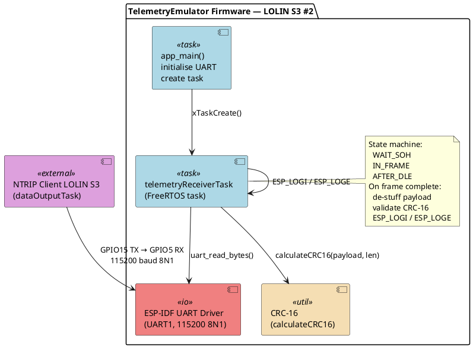
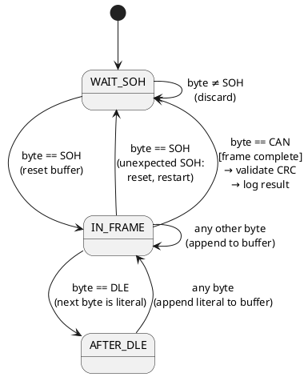
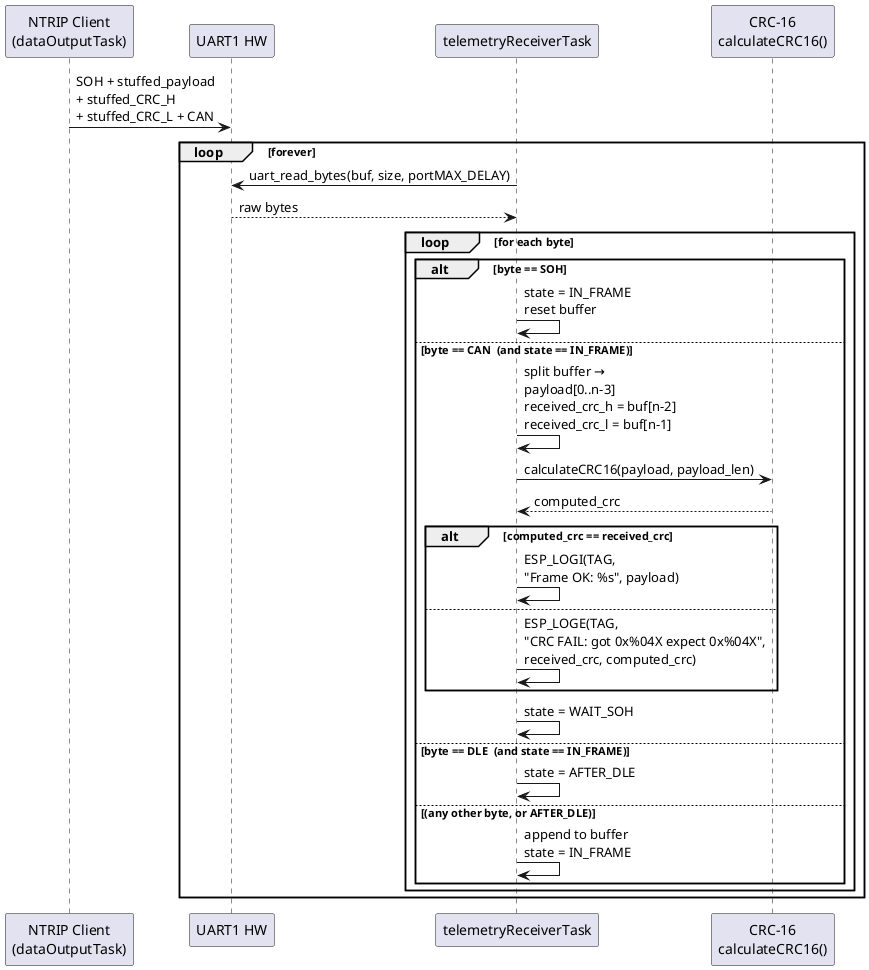

# TelemetryEmulator — Design Document

**Module:** `tests/TelemetryEmulator`
**Version:** 2.0
**Date:** 2026-03-22
**Author:** NTRIP FreeRTOS Client Project

---

## 1. Purpose & Scope

The TelemetryEmulator is a standalone ESP32-S3 (LOLIN S3) firmware application that acts as a **receiver** for the binary telemetry stream produced by the NTRIP Client firmware running on a second LOLIN S3 board. The two boards are connected by a direct UART wire. The TelemetryEmulator decodes incoming frames, validates the CRC-16 checksum, and reports any CRC errors to the debug console via `ESP_LOGE`.

### Goals

- Receive binary telemetry frames from the NTRIP Client LOLIN S3 over a UART link
- Decode the binary framing protocol (byte de-stuffing, SOH/CAN boundary detection)
- Validate each frame's CRC-16 checksum and report failures via `ESP_LOGE`
- Log successfully decoded payloads via `ESP_LOGI` for visual confirmation
- Run as a FreeRTOS task, consistent with the architecture of the main project

### Non-Goals

- Does **not** act as an NTRIP client — it only processes telemetry frames
- Does **not** produce outgoing telemetry frames
- Does **not** run a WiFi stack, HTTP server, or MQTT client
- Does **not** replace the host-side unit tests in `tests/NMEAparser/` or `tests/CRC16/`

---

## 2. Context

### 2.1 System Context

The `dataOutputTask` on the **NTRIP Client** ESP32-S3 transmits binary-framed position telemetry at 10 Hz over UART1 (115200 baud, TX on GPIO15). The TelemetryEmulator runs on a second LOLIN S3 and listens on its own UART RX pin. Both boards share a common GND. This arrangement allows the telemetry receiver logic to be tested independently of the GPS/NTRIP subsystem.

```
┌────────────────────────────────────────────┐
│  NTRIP Client — LOLIN S3 #1                │
│                                            │
│   dataOutputTask                           │
│   UART1 TX → GPIO15 ────────────────────┐  │
└────────────────────────────────────────────┘
                                           │  115200 baud 8N1
                    Physical wire          │
                                           ▼
┌────────────────────────────────────────────┐
│  TelemetryEmulator — LOLIN S3 #2           │
│                                            │
│   GPIO5 RX ← UART1                         │
│   telemetryReceiverTask                    │
│   → decode frame                           │
│   → validate CRC-16                        │
│   → ESP_LOGI (ok) / ESP_LOGE (CRC fail)    │
└────────────────────────────────────────────┘

Shared: GND ─────────────────────────────────
```

### 2.2 Hardware Wiring

| Signal | NTRIP Client (LOLIN S3 #1) | TelemetryEmulator (LOLIN S3 #2) |
|--------|---------------------------|----------------------------------|
| UART TX | GPIO15 (UART1 TX) | — |
| UART RX | — | GPIO5 (UART1 RX) |
| GND | GND | GND |

> **Note:** Only a single wire + GND is required. The link is unidirectional (transmit only from the NTRIP Client).

### 2.3 Relationship to Other Modules

```
tests/
├── catch2/           ← Catch2 v2 single-header (host-side tests only)
├── CRC16/            ← Host-side CRC-16 unit tests (Code::Blocks / MinGW)
├── NMEAparser/       ← Host-side NMEA unit tests (Code::Blocks / MinGW)
└── TelemetryEmulator/
    ├── design.md             ← This document
    ├── CMakeLists.txt        ← ESP-IDF build
    ├── sdkconfig.defaults    ← Minimal ESP-IDF config
    ├── main/
    │   ├── CMakeLists.txt
    │   ├── main.cpp          ← app_main()
    │   ├── telemetryReceiverTask.h
    │   └── telemetryReceiverTask.cpp
    └── components/
        └── crc16/            ← Shared CRC-16 (sourced from src/lib/CRC16)
            ├── CMakeLists.txt
            ├── CRC16.h
            └── CRC16.cpp
```

---

## 3. Protocol Specification

This section is normative. It mirrors exactly what `src/dataOutputTask.cpp` on the NTRIP Client implements. The TelemetryEmulator must decode this protocol faithfully.

### 3.1 Frame Structure

A single telemetry frame has the following wire format:

```
┌───────┬──────────────────────────────┬─────────────┬─────────────┬───────┐
│ SOH   │ Stuffed Message Payload      │ Stuffed     │ Stuffed     │ CAN   │
│ 0x01  │ (ASCII CSV, variable length) │ CRC-H       │ CRC-L       │ 0x18  │
└───────┴──────────────────────────────┴─────────────┴─────────────┴───────┘
  1 byte         N bytes (variable)          1–2 bytes   1–2 bytes   1 byte
```

| Field | Value | Notes |
|-------|-------|-------|
| SOH | `0x01` | Start of frame — **never** byte-stuffed |
| Stuffed Payload | variable | Message bytes after byte stuffing applied |
| Stuffed CRC-H | 1–2 bytes | High byte of CRC-16 after stuffing |
| Stuffed CRC-L | 1–2 bytes | Low byte of CRC-16 after stuffing |
| CAN | `0x18` | End of frame — **never** byte-stuffed |

### 3.2 Byte De-stuffing

**Transmitter (NTRIP Client):** If a payload or CRC byte equals `SOH`, `CAN`, or `DLE`, the transmitter inserts a `DLE` escape byte immediately before it.

**Receiver (TelemetryEmulator):** When a `DLE` byte is encountered, the next byte is the literal data byte (strip the `DLE`, keep what follows).

```
Decoding rule:
  b = next_byte()
  if b == DLE:
      data_byte = next_byte()   // literal, not a control byte
  else:
      data_byte = b
```

| Constant | Value | Meaning |
|----------|-------|---------|
| `FRAME_SOH` | `0x01` | Start of Header (Control-A) |
| `FRAME_CAN` | `0x18` | Cancel / end of frame (Control-X) |
| `FRAME_DLE` | `0x10` | Data Link Escape |

### 3.3 Message Payload Format

The payload is a UTF-8/ASCII CSV string with **no trailing newline**:

```
YYYY-MM-DD HH:mm:ss.sss,LAT,LON,ALT,HEADING,SPEED,FIXQ
```

| Field | Format | Example | Description |
|-------|--------|---------|-------------|
| Date | `YYYY-MM-DD` | `2026-03-22` | Calendar date |
| Time | `HH:mm:ss.sss` | `14:30:52.123` | UTC time with milliseconds |
| LAT | `%.6f` | `-34.123456` | Latitude in decimal degrees (signed) |
| LON | `%.6f` | `150.987654` | Longitude in decimal degrees (signed) |
| ALT | `%.2f` | `123.45` | Altitude in meters above ellipsoid |
| HEADING | `%.2f` | `270.15` | True heading in degrees (0–359.99) |
| SPEED | `%.2f` | `45.67` | Ground speed in km/h |
| FIXQ | `%u` | `4` | GNSS fix quality (see table below) |

**Fix Quality Values:**

| Value | Meaning |
|-------|---------|
| `0` | No fix |
| `1` | GPS (standalone) |
| `2` | DGPS |
| `4` | RTK Fixed |
| `5` | RTK Float |

**Full example payload:**
```
2026-03-22 14:30:52.123,-34.123456,150.987654,123.45,270.15,45.67,4
```

### 3.4 CRC-16 Checksum

- **Algorithm:** CRC-16-CCITT-FALSE (XMODEM variant)
- **Polynomial:** `0x1021`, initial value `0xFFFF`
- **Input:** De-stuffed payload bytes **only** (CRC bytes are not included in the CRC computation)
- **Endianness on wire:** High byte first, then low byte, both byte-stuffed independently

**Receiver validation:**
1. Accumulate all de-stuffed payload bytes.
2. After reading the stuffed CRC-H and CRC-L bytes, de-stuff them to obtain `received_crc`.
3. Compute `computed_crc = calculateCRC16(payload, payload_len)`.
4. If `computed_crc != received_crc` → CRC error.

---

## 4. Architecture

### 4.1 Component Overview

| Component | File(s) | Responsibility |
|-----------|---------|----------------|
| **Application entry** | `main/main.cpp` | `app_main()`: UART init, task creation |
| **Receiver task** | `main/telemetryReceiverTask.h/.cpp` | FreeRTOS task, frame state machine, CRC validation, `ESP_LOG` reporting |
| **CRC-16** | `components/crc16/CRC16.h/.cpp` | Shared CRC-16-CCITT-FALSE calculation (sourced from `src/lib/CRC16`) |

### 4.2 Component Diagram (PlantUML)



### 4.3 Frame Decoder State Machine

The receiver task processes incoming bytes one at a time using a three-state machine:



**Buffer notes:**
- Maximum frame buffer: 256 bytes (sufficient for the fixed-format payload + 2 CRC bytes)
- On buffer overflow before `CAN`: discard frame, log `ESP_LOGW`, return to `WAIT_SOH`
- The CRC bytes are the **last two bytes** appended before `CAN`; all preceding bytes are payload

### 4.4 Sequence Diagram



---

## 5. Module Definitions

### 5.1 `app_main()` — `main/main.cpp`

Responsibilities:
1. Configure UART1 (`UART_NUM_1`, 115200 baud, 8N1, RX=GPIO5)
2. Install the ESP-IDF UART driver with a 1024-byte RX ring buffer
3. Call `telemetry_receiver_task_init()` to create the FreeRTOS task
4. Return (the task scheduler takes over)

### 5.2 `telemetryReceiverTask` — `main/telemetryReceiverTask.h/.cpp`

**Public API:**

```c
/**
 * @brief Initialize and start the Telemetry Receiver Task.
 *
 * Assumes UART has already been configured by app_main().
 *
 * @return ESP_OK on success, error code otherwise.
 */
esp_err_t telemetry_receiver_task_init(void);
```

**Internal behaviour:**

```c
#define RECV_UART_NUM        UART_NUM_1
#define RECV_RX_PIN          GPIO_NUM_5
#define RECV_TX_PIN          GPIO_NUM_4      // Defined but unused
#define RECV_BAUD_RATE       115200
#define RECV_BUF_SIZE        1024
#define RECV_FRAME_BUF_SIZE  256
#define RECV_TASK_STACK_SIZE 4096
#define RECV_TASK_PRIORITY   5

#define FRAME_SOH   0x01
#define FRAME_CAN   0x18
#define FRAME_DLE   0x10

typedef enum {
    STATE_WAIT_SOH,
    STATE_IN_FRAME,
    STATE_AFTER_DLE,
} frame_state_t;
```

**Key counters tracked per task run (logged periodically):**

| Counter | Description |
|---------|-------------|
| `frames_total` | Total complete frames received |
| `frames_ok` | Frames with valid CRC |
| `frames_crc_error` | Frames with CRC mismatch |
| `frames_overflow` | Frames discarded due to buffer overflow |

Statistics are logged via `ESP_LOGI` every 100 frames.

### 5.3 CRC-16 Component — `components/crc16/`

The CRC-16 implementation is sourced directly from `src/lib/CRC16.h` and `src/lib/CRC16.cpp` of the parent project. The component's `CMakeLists.txt` registers it as an ESP-IDF component so it can be linked by `main`.

```c
/**
 * @brief Calculate CRC-16/CCITT-FALSE checksum.
 *
 * @param data   Pointer to data buffer.
 * @param length Number of bytes.
 * @return       16-bit CRC value.
 */
uint16_t calculateCRC16(const uint8_t* data, size_t length);
```

---

## 6. Logging Behaviour

All log output uses the standard `ESP_LOG` macros. The default log level is `INFO`.

| Event | Log level | Format |
|-------|-----------|--------|
| Task started | `INFO` | `"Telemetry Receiver Task started, listening on UART1 RX=GPIO5"` |
| Frame received, CRC OK | `INFO` | `"Frame OK [%u]: %s"` (frame count, payload string) |
| CRC mismatch | `ERROR` | `"CRC FAIL [%u]: received=0x%04X computed=0x%04X payload='%.*s'"` |
| Buffer overflow | `WARN` | `"Frame buffer overflow after %d bytes — discarding frame"` |
| Statistics | `INFO` | `"Stats: total=%u ok=%u crc_err=%u overflow=%u"` |

---

## 7. Build System

### 7.1 Toolchain

| Item | Requirement |
|------|-------------|
| SDK | ESP-IDF v5.x |
| Board | LOLIN S3 (ESP32-S3) |
| Build tool | `idf.py` or PlatformIO |
| Flash monitor | `idf.py monitor` or PlatformIO serial monitor |

### 7.2 ESP-IDF Project Structure

```
tests/TelemetryEmulator/
├── CMakeLists.txt         ← Top-level: cmake_minimum_required + project()
├── sdkconfig.defaults     ← Minimal config (log level, UART, no WiFi/BT)
├── main/
│   ├── CMakeLists.txt     ← idf_component_register(SRCS main.cpp ...)
│   ├── main.cpp
│   ├── telemetryReceiverTask.h
│   └── telemetryReceiverTask.cpp
└── components/
    └── crc16/
        ├── CMakeLists.txt ← idf_component_register(SRCS CRC16.cpp ...)
        ├── CRC16.h
        └── CRC16.cpp
```

### 7.3 Top-level `CMakeLists.txt`

```cmake
cmake_minimum_required(VERSION 3.16)
include($ENV{IDF_PATH}/tools/cmake/project.cmake)
project(TelemetryEmulator)
```

### 7.4 `sdkconfig.defaults`

```
CONFIG_ESP_DEFAULT_CPU_FREQ_MHZ_240=y
CONFIG_ESPTOOLPY_FLASHSIZE_4MB=y
CONFIG_LOG_DEFAULT_LEVEL_INFO=y
CONFIG_ESP_SYSTEM_EVENT_TASK_STACK_SIZE=4096
# Disable unused subsystems to minimise flash size
CONFIG_BT_ENABLED=n
CONFIG_WIFI_ENABLED=n
```

### 7.5 Build & Flash Commands

```bash
cd tests/TelemetryEmulator
idf.py set-target esp32s3
idf.py build
idf.py -p COM<n> flash monitor
```

---

## 8. Error Handling

| Condition | Behaviour |
|-----------|----------|
| UART driver install fails | `ESP_LOGE` + `abort()` in `app_main()` |
| Unexpected `SOH` mid-frame | Reset state machine, restart from new `SOH`, `ESP_LOGW` |
| Frame buffer overflow | Discard frame, `ESP_LOGW`, increment `frames_overflow`, return to `WAIT_SOH` |
| CRC mismatch | Log full details with `ESP_LOGE`, increment `frames_crc_error`, continue |
| Payload not null-terminated | Emitter always produces ASCII payloads ≤ 140 bytes; receiver null-terminates after `CAN` |

---

## 9. Design Decisions & Rationale

| Decision | Rationale |
|----------|-----------|
| LOLIN S3 (ESP32-S3) instead of Windows PC | Both boards are physically the same; using the same platform and SDK as the rest of the project eliminates a cross-platform layer. |
| FreeRTOS task + ESP-IDF UART driver | Consistent with the architecture of the main project; ring-buffered DMA-backed reads avoid byte drop at 115200 baud. |
| State machine with SOH/CAN boundaries | Directly mirrors the transmitter's framing; robust to partial reads from `uart_read_bytes`. |
| CRC validated on every frame | The primary purpose of this module is CRC verification; every frame must be checked. |
| `ESP_LOGE` for CRC failures | Errors appear in red in the IDF monitor and serial log, making failures immediately visible during testing. |
| Separate ESP-IDF component for CRC-16 | Keeps the CRC implementation in one place; the same source file can be shared with `src/lib/` in the parent project. |
| No WiFi / BT in `sdkconfig.defaults` | Minimises build time and flash footprint; this firmware does nothing over the network. |

---

## 10. Open Issues / Future Work

| # | Item | Priority |
|---|------|----------|
| 1 | Parse the decoded payload CSV and display individual fields (lat, lon, alt, fix quality) in the log | Low |
| 2 | Add a statistics UART output so results can be read by a second device or test harness | Low |
| 3 | Add Catch2-based host-side unit test for the frame decoder logic (stripped of ESP-IDF dependencies) | Medium |
| 4 | Add PlatformIO `platformio.ini` as an alternative build method alongside `idf.py` | Low |
