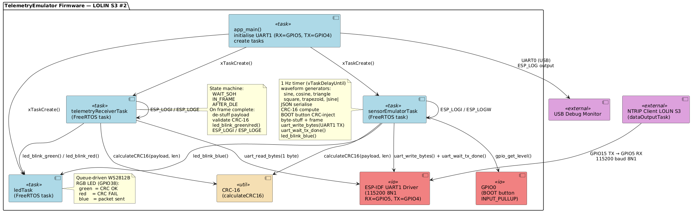
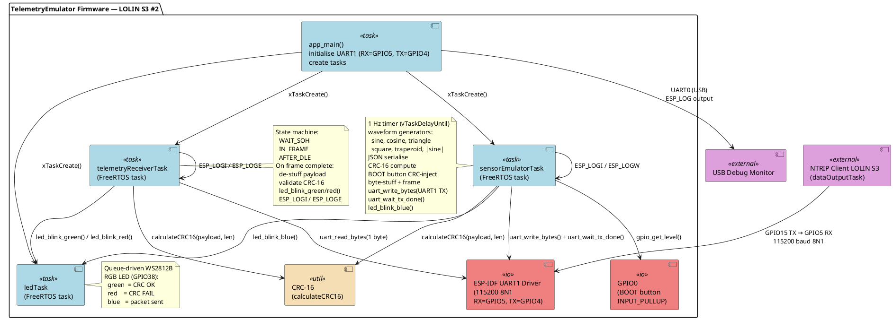
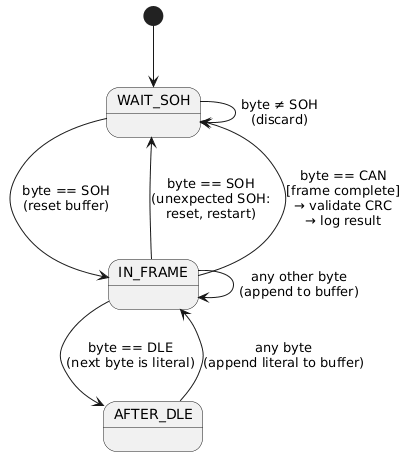
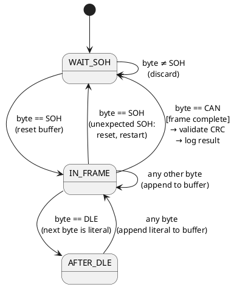
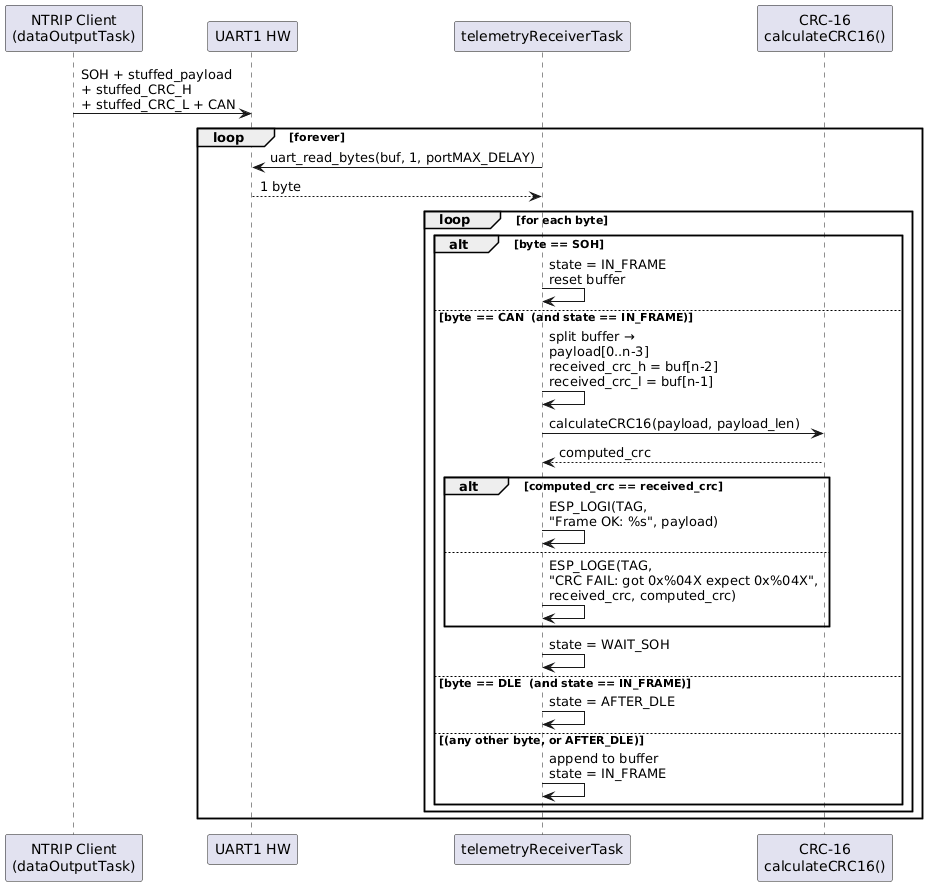
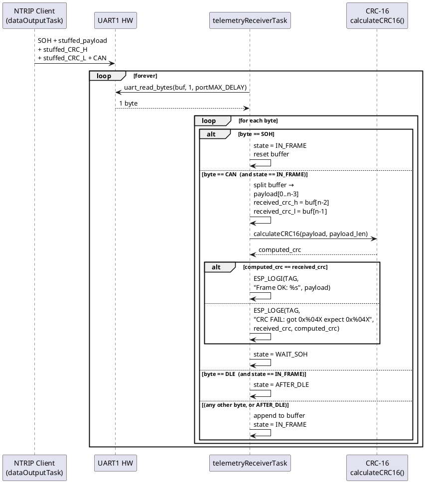

# TelemetryEmulator — Design Document

**Module:** `tests/TelemetryEmulator`
**Version:** 4.1
**Date:** 2026-03-23
**Author:** NTRIP FreeRTOS Client Project

---

## 1. Purpose & Scope

The TelemetryEmulator is a standalone ESP32-S3 (LOLIN S3) firmware application that runs two independent FreeRTOS tasks:

1. **`telemetryReceiverTask`** — acts as a **receiver** for the binary telemetry stream produced by the NTRIP Client firmware running on a second LOLIN S3 board. The two boards are connected by a direct UART wire. The task decodes incoming frames, validates the CRC-16 checksum, and reports any CRC errors to the debug console via `ESP_LOGE`.

2. **`sensorEmulatorTask`** — generates a deterministic JSON telemetry packet every 1 second, wraps it in the same SOH/DLE-stuffed/CRC-16/CAN binary frame format used by the NTRIP Client, and transmits it over UART1 TX (GPIO4). Each JSON field is driven by a periodic waveform (sine, cosine, triangle, square, trapezoid, or rectified sine) scaled to the min/max range specified by the MQTT interface in `sensorData.md`. Because the output is protocol-compatible with the receiver, GPIO4 TX can be wired to GPIO5 RX for a self-contained loopback test that exercises the full encode → decode → CRC-validate chain on a single board.

### Goals

- Receive binary telemetry frames from the NTRIP Client LOLIN S3 over a UART link
- Decode the binary framing protocol (byte de-stuffing, SOH/CAN boundary detection)
- Validate each frame's CRC-16 checksum and report failures via `ESP_LOGE`
- Log successfully decoded payloads via `ESP_LOGI` for visual confirmation
- Generate deterministic JSON telemetry packets every 1 second with signal values driven by periodic waveforms (sine, cosine, triangle, square, trapezoid, |sine|)
- Encode each packet as a binary frame (SOH + byte-stuffed payload + stuffed CRC-16 + CAN) identical to the format received by `telemetryReceiverTask`
- Transmit binary-framed packets over UART1 TX (GPIO4, 115200 baud)
- Support a single-board loopback test by connecting GPIO4 TX → GPIO5 RX
- Run both functions as independent FreeRTOS tasks, consistent with the architecture of the main project

### Non-Goals

- Does **not** act as an NTRIP client — it only processes telemetry frames
- Does **not** run a WiFi stack, HTTP server, or MQTT client
- Does **not** replace the host-side unit tests in `tests/NMEAparser/` or `tests/CRC16/`

---

## 2. Context

### 2.1 System Context

The `dataOutputTask` on the **NTRIP Client** ESP32-S3 transmits binary-framed position telemetry at 10 Hz over UART1 (115200 baud, TX on GPIO15). The TelemetryEmulator runs on a second LOLIN S3 and listens on its own UART RX pin. Both boards share a common GND. This arrangement allows the telemetry receiver logic to be tested independently of the GPS/NTRIP subsystem.

```
┌────────────────────────────────────────────┐
│  NTRIP Client — LOLIN S3 #1                │
│                                            │
│   dataOutputTask                           │
│   UART1 TX → GPIO15 ────────────────────┐  │
└────────────────────────────────────────────┘
                                           │  115200 baud 8N1
                    Physical wire          │
                                           ▼
┌─────────────────────────────────────────────────────┐
│  TelemetryEmulator — LOLIN S3 #2                    │
│                                                     │
│   GPIO5 RX ← UART1   telemetryReceiverTask          │
│                        → decode frame               │
│                        → validate CRC-16            │
│                        → ESP_LOGI / ESP_LOGE        │
│                                                     │
│   UART1 TX → GPIO4    sensorEmulatorTask            │
│                        → waveform-driven signals    │
│                        → JSON payload every 1 s     │
│                        → binary framed (SOH…CAN)    │
└─────────────────────────────────────────────────────┘

Shared: GND ──────────────────────────────────────────
```

### 2.2 Hardware Wiring

| Signal | NTRIP Client (LOLIN S3 #1) | TelemetryEmulator (LOLIN S3 #2) | Direction |
|--------|---------------------------|----------------------------------|----------|
| UART1 TX | GPIO15 (UART1 TX) | — | Client → Emulator |
| UART1 RX | — | GPIO5 (UART1 RX) | Client → Emulator |
| UART1 TX | — | GPIO4 (UART1 TX) | Emulator → consumer |
| GND | GND | GND | shared |

> **Note:** The TelemetryEmulator uses a single UART peripheral (UART1) for both tasks. `telemetryReceiverTask` reads on the RX wire (GPIO5 ← NTRIP Client GPIO15) and `sensorEmulatorTask` writes on the TX wire (GPIO4 → serial terminal / test harness). The two wires are electrically independent.

### 2.3 Relationship to Other Modules

```
tests/
├── catch2/           ← Catch2 v2 single-header (host-side tests only)
├── CRC16/            ← Host-side CRC-16 unit tests (Code::Blocks / MinGW)
├── NMEAparser/       ← Host-side NMEA unit tests (Code::Blocks / MinGW)
└── TelemetryEmulator/
    ├── documentation/
    │   ├── design.md         ← This document
    │   └── sensorData.md     ← MQTT sensor data specification
    ├── CMakeLists.txt        ← ESP-IDF build
    ├── sdkconfig.defaults    ← Minimal ESP-IDF config
    ├── main/
    │   ├── CMakeLists.txt
    │   ├── main.cpp                  ← app_main()
    │   ├── ledTask.h
    │   ├── ledTask.cpp               ← WS2812B RGB LED indicator task
    │   ├── telemetryReceiverTask.h
    │   ├── telemetryReceiverTask.cpp
    │   ├── sensorEmulatorTask.h
    │   └── sensorEmulatorTask.cpp
    └── components/
        └── crc16/            ← Shared CRC-16 (sourced from src/lib/CRC16)
            ├── CMakeLists.txt
            ├── CRC16.h
            └── CRC16.cpp
```

---

## 3. Protocol Specification

This section is normative. It mirrors exactly what `src/dataOutputTask.cpp` on the NTRIP Client implements. The TelemetryEmulator must decode this protocol faithfully.

### 3.1 Frame Structure

A single telemetry frame has the following wire format:

```
┌───────┬──────────────────────────────┬─────────────┬─────────────┬───────┐
│ SOH   │ Stuffed Message Payload      │ Stuffed     │ Stuffed     │ CAN   │
│ 0x01  │ (ASCII CSV, variable length) │ CRC-H       │ CRC-L       │ 0x18  │
└───────┴──────────────────────────────┴─────────────┴─────────────┴───────┘
  1 byte         N bytes (variable)          1–2 bytes   1–2 bytes   1 byte
```

| Field | Value | Notes |
|-------|-------|-------|
| SOH | `0x01` | Start of frame — **never** byte-stuffed |
| Stuffed Payload | variable | Message bytes after byte stuffing applied |
| Stuffed CRC-H | 1–2 bytes | High byte of CRC-16 after stuffing |
| Stuffed CRC-L | 1–2 bytes | Low byte of CRC-16 after stuffing |
| CAN | `0x18` | End of frame — **never** byte-stuffed |

### 3.2 Byte De-stuffing

**Transmitter (NTRIP Client):** If a payload or CRC byte equals `SOH`, `CAN`, or `DLE`, the transmitter inserts a `DLE` escape byte immediately before it.

**Receiver (TelemetryEmulator):** When a `DLE` byte is encountered, the next byte is the literal data byte (strip the `DLE`, keep what follows).

```
Decoding rule:
  b = next_byte()
  if b == DLE:
      data_byte = next_byte()   // literal, not a control byte
  else:
      data_byte = b
```

| Constant | Value | Meaning |
|----------|-------|---------|
| `FRAME_SOH` | `0x01` | Start of Header (Control-A) |
| `FRAME_CAN` | `0x18` | Cancel / end of frame (Control-X) |
| `FRAME_DLE` | `0x10` | Data Link Escape |

### 3.3 Message Payload Format

The payload is a UTF-8/ASCII CSV string with **no trailing newline**:

```
YYYY-MM-DD HH:mm:ss.sss,LAT,LON,ALT,HEADING,SPEED,FIXQ
```

| Field | Format | Example | Description |
|-------|--------|---------|-------------|
| Date | `YYYY-MM-DD` | `2026-03-22` | Calendar date |
| Time | `HH:mm:ss.sss` | `14:30:52.123` | UTC time with milliseconds |
| LAT | `%.6f` | `-34.123456` | Latitude in decimal degrees (signed) |
| LON | `%.6f` | `150.987654` | Longitude in decimal degrees (signed) |
| ALT | `%.2f` | `123.45` | Altitude in meters above ellipsoid |
| HEADING | `%.2f` | `270.15` | True heading in degrees (0–359.99) |
| SPEED | `%.2f` | `45.67` | Ground speed in km/h |
| FIXQ | `%u` | `4` | GNSS fix quality (see table below) |

**Fix Quality Values:**

| Value | Meaning |
|-------|---------|
| `0` | No fix |
| `1` | GPS (standalone) |
| `2` | DGPS |
| `4` | RTK Fixed |
| `5` | RTK Float |

**Full example payload:**
```
2026-03-22 14:30:52.123,-34.123456,150.987654,123.45,270.15,45.67,4
```

### 3.4 CRC-16 Checksum

- **Algorithm:** CRC-16-CCITT-FALSE (XMODEM variant)
- **Polynomial:** `0x1021`, initial value `0xFFFF`
- **Input:** De-stuffed payload bytes **only** (CRC bytes are not included in the CRC computation)
- **Endianness on wire:** High byte first, then low byte, both byte-stuffed independently

**Receiver validation:**
1. Accumulate all de-stuffed payload bytes.
2. After reading the stuffed CRC-H and CRC-L bytes, de-stuff them to obtain `received_crc`.
3. Compute `computed_crc = calculateCRC16(payload, payload_len)`.
4. If `computed_crc != received_crc` → CRC error.

---

## 4. Architecture

### 4.1 Component Overview

| Component | File(s) | Responsibility |
|-----------|---------|----------------|
| **Application entry** | `main/main.cpp` | `app_main()`: UART1 init (RX=GPIO5, TX=GPIO4, with TX ring buffer), then starts LED, receiver, and emulator tasks |
| **LED indicator task** | `main/ledTask.h/.cpp` | FreeRTOS task driven by a queue; blinks the onboard WS2812B RGB LED: green (CRC OK), red (CRC FAIL), blue (packet sent) |
| **Receiver task** | `main/telemetryReceiverTask.h/.cpp` | FreeRTOS task, frame state machine, CRC validation, `ESP_LOG` reporting — uses UART1 RX |
| **Sensor emulator task** | `main/sensorEmulatorTask.h/.cpp` | FreeRTOS task, deterministic waveform generation, JSON serialisation, UART1 TX output at 1 Hz; BOOT button (GPIO0) triggers CRC injection |
| **CRC-16** | `components/crc16/CRC16.h/.cpp` | Shared CRC-16-CCITT-FALSE calculation (sourced from `src/lib/CRC16`) |

### 4.2 Component Diagram (PlantUML)





### 4.3 Frame Decoder State Machine

The receiver task processes incoming bytes one at a time using a three-state machine:





**Buffer notes:**
- Maximum frame buffer: 256 bytes (sufficient for the fixed-format payload + 2 CRC bytes)
- On buffer overflow before `CAN`: discard frame, log `ESP_LOGW`, return to `WAIT_SOH`
- The CRC bytes are the **last two bytes** appended before `CAN`; all preceding bytes are payload

### 4.4 Sequence Diagram





---

## 5. Module Definitions

### 5.1 `app_main()` — `main/main.cpp`

Responsibilities:
1. Configure and install UART1 (`UART_NUM_1`, 115200 baud, 8N1, RX=GPIO5, TX=GPIO4) with a 1024-byte RX ring buffer and a 512-byte TX ring buffer
2. Call `led_task_init()` to create the LED indicator FreeRTOS task (configures RMT for the onboard WS2812B on GPIO38)
3. Call `telemetry_receiver_task_init()` to create the telemetry receiver FreeRTOS task
4. Call `sensor_emulator_task_init()` to create the sensor emulator FreeRTOS task (configures GPIO0 as input with pull-up, then creates the task; reuses UART1)
5. Return (the task scheduler takes over)

### 5.2 `telemetryReceiverTask` — `main/telemetryReceiverTask.h/.cpp`

**Public API:**

```c
/**
 * @brief Initialize and start the Telemetry Receiver Task.
 *
 * Assumes UART has already been configured by app_main().
 *
 * @return ESP_OK on success, error code otherwise.
 */
esp_err_t telemetry_receiver_task_init(void);
```

**Internal behaviour:**

```c
#define RECV_UART_NUM        UART_NUM_1
#define RECV_RX_PIN          GPIO_NUM_5
#define RECV_TX_PIN          GPIO_NUM_4      // Defined but unused
#define RECV_BAUD_RATE       115200
#define RECV_BUF_SIZE        1024
#define RECV_FRAME_BUF_SIZE  256
#define RECV_TASK_STACK_SIZE 4096
#define RECV_TASK_PRIORITY   5

#define FRAME_SOH   0x01
#define FRAME_CAN   0x18
#define FRAME_DLE   0x10

typedef enum {
    STATE_WAIT_SOH,
    STATE_IN_FRAME,
    STATE_AFTER_DLE,
} frame_state_t;
```

**Key counters tracked per task run (logged periodically):**

| Counter | Description |
|---------|-------------|
| `frames_total` | Total complete frames received |
| `frames_ok` | Frames with valid CRC |
| `frames_crc_error` | Frames with CRC mismatch |
| `frames_overflow` | Frames discarded due to buffer overflow |

Statistics are logged via `ESP_LOGI` every 100 frames.

### 5.3 `sensorEmulatorTask` — `main/sensorEmulatorTask.h/.cpp`

**Public API:**

```c
/**
 * @brief Initialise and start the Sensor Emulator Task.
 *
 * Assumes UART1 has already been configured by app_main() with TX=GPIO4.
 * Transmits one binary-framed JSON telemetry packet per second over
 * UART1 TX (GPIO4, 115200 8N1).  Frame format is identical to the
 * protocol decoded by telemetryReceiverTask (SOH + stuffed payload +
 * stuffed CRC-16/CCITT-FALSE + CAN).
 *
 * @return ESP_OK on success, error code otherwise.
 */
esp_err_t sensor_emulator_task_init(void);
```

**Internal configuration:**

```c
#define EMUL_UART_NUM        UART_NUM_1   /* shared with telemetryReceiverTask */
#define EMUL_JSON_BUF_SIZE   384          /* max JSON payload length            */
#define EMUL_WIRE_BUF_SIZE   (2 * EMUL_JSON_BUF_SIZE + 6)  /* worst-case frame */
#define EMUL_TASK_STACK_SIZE   4096
#define EMUL_TASK_PRIORITY     4
#define EMUL_PERIOD_MS         1000u

/* CRC-inject button — LOLIN S3 BOOT button, active LOW, internal pull-up */
#define EMUL_CRC_INJECT_PIN    GPIO_NUM_0

/* Framing constants — identical to those in telemetryReceiverTask */
#define FRAME_SOH  0x01u
#define FRAME_CAN  0x18u
#define FRAME_DLE  0x10u
```

> UART1 driver installation, baud rate, and pin assignment (TX=GPIO4) are performed exclusively by `app_main()`. `sensor_emulator_task_init()` configures GPIO0 as an input with pull-up and then creates the FreeRTOS task.

**CRC injection (BOOT button):** After the CRC is computed over the clean payload but before the wire frame is built, the task reads GPIO0. If the BOOT button is held (pin LOW), bit 0 of the first payload byte is flipped. The CRC in the frame remains correct for the *original* payload bytes, so the receiver's recomputed CRC will not match → `CRC FAIL`. Releasing the button restores clean frames immediately. A `WARN`-level log is emitted for every corrupted frame.

**Sender log timing:** `uart_wait_tx_done()` is called after `uart_write_bytes()` so the `SensorEmul` log line appears only after the last bit of the frame has cleared the UART shift register. This ensures the log timestamp reflects the actual end-of-transmission rather than the moment bytes were queued in the TX ring buffer.

**Wire frame produced per packet:**

```
┌───────┬──────────────────────────────┬─────────────┬─────────────┬───────┐
│ SOH   │ Stuffed JSON Payload         │ Stuffed     │ Stuffed     │ CAN   │
│ 0x01  │ (ASCII, variable length)     │ CRC-H       │ CRC-L       │ 0x18  │
└───────┴──────────────────────────────┴─────────────┴─────────────┴───────┘
```

The byte-stuffing and CRC-16/CCITT-FALSE rules are **identical** to the protocol decoded by `telemetryReceiverTask` (see §3). The JSON payload is pure printable ASCII so control bytes (`0x01`, `0x10`, `0x18`) cannot appear in the payload in practice, but the stuffing loop handles them correctly regardless. The two CRC bytes are stuffed independently.

**JSON output schema** (mirrors the MQTT payload defined in `sensorData.md`):

```json
{"seq":N,"tim":"HH:MM:SS.mmm",
 "vhl":{"accX":...},"accY":...},"accZ":...},"thr":...},
 "mtr":{"pwr":...},"rpm":...},"trq":...},
 "spc":{"vsc":...},"tankP":...},"fan":...},"h2P1":...},"h2P2":...}}
```

**Waveform assignments:**

| JSON key | Range | Waveform | Period |
|----------|-------|----------|--------|
| `accX` | −4096 … +4095 counts | sine | 5 s |
| `accY` | −4096 … +4095 counts | cosine | 7 s |
| `accZ` | −4096 … +4095 counts | triangle | 3 s |
| `thr` | 0 … 100 % | trapezoid | 10 s |
| `pwr` | −1000 … +1000 W | sine | 8 s |
| `rpm` | −10000 … +10000 RPM | cosine | 12 s |
| `trq` | −100 … +100 Nm | square | 6 s |
| `vsc` | 0.0 … 100.0 V | triangle | 15 s |
| `tankP` | 0.00 … 500.00 Bar | trapezoid | 20 s |
| `fan` | 0 … 100 % | \|sine\| (rectified) | 10 s |
| `h2P1` | 0.00 … 1.00 Bar | sine | 4 s |
| `h2P2` | 0.00 … 1.00 Bar | cosine | 6 s |

**Waveform formulae** (continuous-time, all periods independent):

| Waveform | Formula |
|----------|---------|
| Sine | `mid + amp·sin(2π·t/T)` |
| Cosine | `mid + amp·cos(2π·t/T)` |
| Triangle | `mid + amp·(4φ−1)` if φ<0.5 else `mid + amp·(3−4φ)` where φ=mod(t,T)/T |
| Square | `hi` if φ<0.5 else `lo` |
| Trapezoid | 25% rise → 25% hold-high → 25% fall → 25% hold-low |
| \|Sine\| | `lo + \|sin(2π·t/T)\|·(hi−lo)` — non-negative only |

The time base uses `esp_timer_get_time()` (µs since boot), ensuring phase continuity and wakeup accuracy independent of FreeRTOS tick jitter. `vTaskDelayUntil` is used for the 1 Hz cadence.

### 5.4 CRC-16 Component — `components/crc16/`

The CRC-16 implementation is sourced directly from `src/lib/CRC16.h` and `src/lib/CRC16.cpp` of the parent project. The component's `CMakeLists.txt` registers it as an ESP-IDF component so it can be linked by `main`.

```c
/**
 * @brief Calculate CRC-16/CCITT-FALSE checksum.
 *
 * @param data   Pointer to data buffer.
 * @param length Number of bytes.
 * @return       16-bit CRC value.
 */
uint16_t calculateCRC16(const uint8_t* data, size_t length);
```

---

## 6. Logging Behaviour

All log output uses the standard `ESP_LOG` macros. The default log level is `INFO`.

### 6.1 `telemetryReceiverTask` (tag `TelemetryRx`)

| Event | Log level | Format |
|-------|-----------|--------|
| Task started | `INFO` | `"Telemetry Receiver Task started, listening on UART1 RX=GPIO5"` |
| Frame received, CRC OK | `INFO` | `"Frame OK: %s"` (payload string) |
| CRC mismatch | `ERROR` | `"CRC FAIL: received=0x%04X computed=0x%04X payload='%s'"` |
| Buffer overflow | `WARN` | `"Frame buffer overflow after %d bytes — discarding frame"` |
| Unexpected SOH mid-frame | `WARN` | `"Unexpected SOH mid-frame after %d bytes — restarting"` |
| Statistics | `INFO` | `"Stats: total=%u ok=%u crc_err=%u overflow=%u"` |

### 6.2 `sensorEmulatorTask` (tag `SensorEmul`)

| Event | Log level | Format |
|-------|-----------|--------|
| Task started | `INFO` | `"Sensor Emulator Task started — binary framed output on UART1 TX=GPIO4 @ 115200"` |
| Packet transmitted | `INFO` | `"seq=%u payload=%d wire=%d crc=0x%04X"` |
| CRC inject active | `WARN` | `"CRC inject active — corrupting frame seq=%u"` |
| JSON buffer overflow | `ERROR` | `"JSON buffer overflow at seq=%u (len=%d)"` |

---

## 7. Build System

### 7.1 Toolchain

| Item | Requirement |
|------|-------------|
| SDK | ESP-IDF v5.x |
| Board | LOLIN S3 (ESP32-S3) |
| Build tool | `idf.py` or PlatformIO |
| Flash monitor | `idf.py monitor` or PlatformIO serial monitor |

### 7.2 ESP-IDF Project Structure

```
tests/TelemetryEmulator/
├── documentation/
│   ├── design.md               ← This document
│   └── sensorData.md           ← MQTT sensor data specification
├── CMakeLists.txt              ← Top-level: cmake_minimum_required + project()
├── sdkconfig.defaults          ← Minimal config (log level, UART, no WiFi/BT)
├── main/
│   ├── CMakeLists.txt          ← idf_component_register(SRCS main.cpp ...)
│   ├── main.cpp
│   ├── ledTask.h
│   ├── ledTask.cpp             ← WS2812B RGB LED indicator task
│   ├── telemetryReceiverTask.h
│   ├── telemetryReceiverTask.cpp
│   ├── sensorEmulatorTask.h
│   └── sensorEmulatorTask.cpp
└── components/
    └── crc16/
        ├── CMakeLists.txt      ← idf_component_register(SRCS CRC16.cpp ...)
        ├── CRC16.h
        └── CRC16.cpp
```

### 7.3 Top-level `CMakeLists.txt`

```cmake
cmake_minimum_required(VERSION 3.16)
include($ENV{IDF_PATH}/tools/cmake/project.cmake)
project(TelemetryEmulator)
```

### 7.4 `sdkconfig.defaults`

```
CONFIG_ESP_DEFAULT_CPU_FREQ_MHZ_240=y
CONFIG_ESPTOOLPY_FLASHSIZE_4MB=y
CONFIG_LOG_DEFAULT_LEVEL_INFO=y
CONFIG_ESP_SYSTEM_EVENT_TASK_STACK_SIZE=4096
# Disable unused subsystems to minimise flash size
CONFIG_BT_ENABLED=n
CONFIG_WIFI_ENABLED=n
```

### 7.5 Build & Flash Commands

```bash
cd tests/TelemetryEmulator
idf.py set-target esp32s3
idf.py build
idf.py -p COM<n> flash monitor
```

---

## 8. Error Handling

| Condition | Behaviour |
|-----------|----------|
| UART1 driver install fails | `ESP_LOGE` + `abort()` in `app_main()` |
| `xTaskCreate` fails (any task) | `ESP_LOGE`, init function returns `ESP_FAIL`; `app_main()` calls `abort()` |
| Unexpected `SOH` mid-frame | Reset state machine, restart from new `SOH`, `ESP_LOGW` |
| Frame buffer overflow | Discard frame, `ESP_LOGW`, increment `frames_overflow`, return to `WAIT_SOH` |
| CRC mismatch | Log full details with `ESP_LOGE`, increment `frames_crc_error`, continue |
| Payload not null-terminated | Emitter always produces ASCII payloads ≤ 140 bytes; receiver null-terminates after `CAN` |
| JSON serialisation overflow | `ESP_LOGE`, packet skipped; sequence counter still incremented |

---

## 9. Design Decisions & Rationale

| Decision | Rationale |
|----------|-----------|
| LOLIN S3 (ESP32-S3) instead of Windows PC | Both boards are physically the same; using the same platform and SDK as the rest of the project eliminates a cross-platform layer. |
| FreeRTOS task + ESP-IDF UART driver | Consistent with the architecture of the main project; ring-buffered DMA-backed reads avoid byte drop at 115200 baud. |
| State machine with SOH/CAN boundaries | Directly mirrors the transmitter's framing; robust to partial reads from `uart_read_bytes`. |
| CRC validated on every frame | The primary purpose of this module is CRC verification; every frame must be checked. |
| `ESP_LOGE` for CRC failures | Errors appear in red in the IDF monitor and serial log, making failures immediately visible during testing. |
| Separate ESP-IDF component for CRC-16 | Keeps the CRC implementation in one place; the same source file can be shared with `src/lib/` in the parent project. |
| No WiFi / BT in `sdkconfig.defaults` | Minimises build time and flash footprint; this firmware does nothing over the network. |
| Deterministic waveforms for sensor emulation | Periodic signals with known analytical formulae make it trivial to verify receiver-side correctness: expected values at any timestamp can be computed offline. |
| Different periods per signal | Incommensurable periods (e.g. 5 s, 7 s, 3 s …) ensure all combinations of field values occur within a short observation window, maximising test coverage. |
| `esp_timer_get_time()` as time base | Provides µs resolution, monotonically increasing from boot, independent of FreeRTOS tick rate — ensures waveform phase is continuous and accurate. |
| `vTaskDelayUntil` for 1 Hz cadence | Compensates for execution time inside the task body so the inter-packet interval stays exactly 1 s regardless of JSON serialisation overhead. |
| `sensorEmulatorTask` uses same binary framing as `telemetryReceiverTask` | The TX output can be looped back to an RX input (or fed into any conformant NTRIP Client receiver) for end-to-end testing without a real GPS board. It also makes the two task halves symmetric and validates that the framing/CRC implementation is self-consistent. |
| JSON payload inside binary frame | The frame envelope is identical to the position-telemetry protocol; only the payload content differs (JSON sensor data rather than CSV position). Keeps the wire protocol uniform while allowing the payload to carry any ASCII data. |
| `uart_read_bytes` with `size=1` | Reading one byte per call with `portMAX_DELAY` blocks only until the next UART byte arrives, so the state machine processes each byte immediately and `Frame OK` is logged the instant `CAN` is received — no batching delay. |
| `uart_wait_tx_done()` after `uart_write_bytes()` | Ensures the `SensorEmul` log timestamp reflects the actual end-of-transmission rather than the moment bytes were queued. In loopback, this means `Frame OK` appears before the sender log, confirming the receiver processed the frame while the UART was still draining. |
| BOOT button (GPIO0) as CRC-inject trigger | Provides a hardware-controlled, hands-on way to exercise the CRC error path without modifying firmware. Holding the button corrupts every outgoing frame; releasing it restores clean frames immediately, exercising both the error and recovery paths at will. |

---

## 10. Loopback Self-Test

Because `sensorEmulatorTask` produces frames that are protocol-identical to those consumed by `telemetryReceiverTask`, the two tasks can be run in a **loopback configuration** on a single board with no external hardware other than a short wire.

### 10.1 Hardware Setup

Connect a single wire between:

| From | To |
|------|----|
| GPIO4 (UART1 TX — emulator output) | GPIO5 (UART1 RX — receiver input) |

No NTRIP Client board is required. Both tasks run on the same LOLIN S3 #2.

```
┌───────────────────────────────────────────────────────────┐
│  TelemetryEmulator — LOLIN S3 #2  (loopback mode)         │
│                                                           │
│   sensorEmulatorTask                                      │
│   UART1 TX → GPIO4 ──┐                                    │
│                      │  short wire on-board               │
│   UART1 RX ← GPIO5 ◄─┘                                    │
│   telemetryReceiverTask                                   │
│   → decode frame                                          │
│   → validate CRC-16                                       │
│   → ESP_LOGI / ESP_LOGE                                   │
│                                                           │
│   UART0 → USB debug monitor                               │
└───────────────────────────────────────────────────────────┘
```

### 10.2 Expected Behaviour

| Observation | Expected |
|-------------|----------|
| `TelemetryRx` log after each emitter packet | `Frame OK: {"seq":N,...}` |
| `TelemetryRx` CRC errors | **None** |
| `TelemetryRx` buffer overflows | None (JSON payload ≤ ~250 bytes < 256-byte frame buffer) |
| `SensorEmul` log per packet | `seq=N payload=P wire=W crc=0x????` (appears after `Frame OK`) |
| Packet rate | 1 frame/second from emulator; both tasks log 1 line/second |
| Log order per packet | `TelemetryRx: Frame OK` first, then `SensorEmul: seq=N` a few milliseconds later |

Any `CRC FAIL` line in the monitor output (without holding the BOOT button) indicates a bug in either the byte-stuffing encoder or the de-stuffing decoder and should be investigated immediately.

### 10.3 Procedure

1. Fit a short wire between GPIO4 and GPIO5 on the LOLIN S3.
2. Flash the TelemetryEmulator firmware normally (`idf.py -p COM<n> flash`).
3. Open the serial monitor (`idf.py -p COM<n> monitor`).
4. Verify the startup messages from both tasks appear.
5. Observe that `Frame OK` lines appear at ~1 Hz with no `CRC FAIL` messages.
6. After at least 100 frames, verify the statistics line shows `crc_err=0` and `overflow=0`.
7. Remove the wire; the receiver will go silent while the emulator continues transmitting (its packets are not echoed back).

### 10.4 CRC Injection Test

The BOOT button on the LOLIN S3 (GPIO0, active LOW) can be used at any time during the loopback test to verify that the receiver correctly detects CRC errors:

1. With the loopback wire fitted and the monitor open, confirm `Frame OK` lines are appearing at 1 Hz.
2. Hold the BOOT button down.
3. The monitor should immediately show alternating `SensorEmul: CRC inject active` and `TelemetryRx: CRC FAIL` lines instead of `Frame OK`.
4. Release the button — `Frame OK` lines resume on the next packet.
5. Verify the statistics line (every 100 frames) reflects the correct `crc_err` count.

### 10.5 Limitations

- The loopback validates framing and CRC correctness but **not** payload content correctness — the receiver logs the raw JSON string but does not parse the field values.
- The emitter runs at 1 Hz; the NTRIP Client transmits at 10 Hz. A 10 Hz stress test requires either a second board or a software change to `EMUL_PERIOD_MS`.

---

## 11. Open Issues / Future Work

| # | Item | Priority |
|---|------|----------|
| 1 | Add a Catch2-based host-side unit test for the waveform generators in `sensorEmulatorTask` | Low |
| 2 | ~~`CONFIG_EMUL_PERIOD_MS` sdkconfig option for JSON publish rate~~ — implemented: `main/Kconfig.projbuild` exposes the option; `sdkconfig.defaults` sets the default to 1000 ms | Closed |
